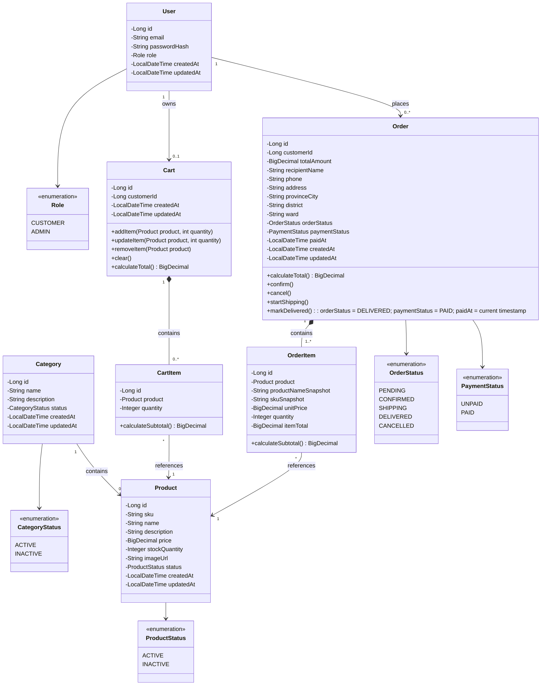

# Class Diagram

## 1. Mục đích

Tài liệu này mô tả cấu trúc các lớp chính của hệ thống Mini E-commerce dựa trên các yêu cầu đã được review và chốt trong thư mục `01-requirements`.

Class Diagram được sử dụng để:

- Mô tả các lớp chính trong hệ thống.
- Xác định thuộc tính và phương thức quan trọng của từng lớp.
- Thể hiện mối quan hệ giữa các lớp.
- Làm cơ sở cho việc triển khai Backend bằng Java Spring Boot.
- Đảm bảo thiết kế hướng đối tượng thống nhất với ERD.
- Làm rõ việc sử dụng `enum`, encapsulation và các quan hệ giữa các đối tượng.

Thiết kế tập trung vào phạm vi MVP, tránh đưa thêm các chức năng không có trong requirement.

---

# 2. Nguyên tắc thiết kế

## 2.1. Bám sát Requirement

Các lớp được thiết kế dựa trên các nghiệp vụ đã được xác định trong:

- `requirement-clarification.md`
- `requirement-specification.md`
- `use-cases.md`

Không tự bổ sung các nghiệp vụ ngoài phạm vi MVP.

## 2.2. Đồng bộ với ERD

Các lớp chính tương ứng với các Entity trong ERD:

| Class | Entity tương ứng |
|---|---|
| `User` | `users` |
| `Category` | `categories` |
| `Product` | `products` |
| `Cart` | `carts` |
| `CartItem` | `cart_items` |
| `Order` | `orders` |
| `OrderItem` | `order_items` |

Không có `Payment` class vì hệ thống không sử dụng bảng `payments`.

## 2.3. Encapsulation

Các thuộc tính của class được quản lý thông qua `private` và chỉ được truy cập hoặc thay đổi thông qua các phương thức phù hợp.

Ví dụ:

```java
private BigDecimal price;
private int stockQuantity;
```

Không nên cho phép các lớp khác tùy ý thay đổi trực tiếp các thuộc tính quan trọng như giá sản phẩm hoặc số lượng tồn kho.

## 2.4. Role không sử dụng kế thừa

Hệ thống có hai nhóm tài khoản:

- `CUSTOMER`
- `ADMIN`

Tuy nhiên, `Customer` và `Admin` không được thiết kế thành hai subclass của `User`.

Thay vào đó, `User` sử dụng `Role`.

Lý do:

- Cả Customer và Admin đều có chung thông tin tài khoản.
- Sự khác biệt chính nằm ở quyền truy cập.
- Không có nhóm thuộc tính riêng đủ lớn để cần tạo hai subclass.
- Tránh sử dụng inheritance không cần thiết.
- Phù hợp với cấu trúc bảng `users` trong ERD.

Việc kiểm soát quyền được thực hiện thông qua `Role` và authorization của Spring Security.

---

# 3. Tổng quan các lớp

### User Management

- `User`
- `Role`

### Product Management

- `Product`
- `Category`
- `ProductStatus`
- `CategoryStatus`

### Shopping Cart

- `Cart`
- `CartItem`

### Order Management

- `Order`
- `OrderItem`
- `OrderStatus`
- `PaymentStatus`

---

# 4. Class Diagram



---

# 5. Đặc tả các Class

## 5.1. User

Đại diện cho tài khoản người dùng trong hệ thống.

| Thuộc tính | Kiểu dữ liệu | Mô tả |
|---|---|---|
| `id` | `Long` | ID duy nhất của tài khoản |
| `email` | `String` | Email đăng nhập |
| `passwordHash` | `String` | Mật khẩu đã được mã hóa |
| `role` | `Role` | Vai trò của tài khoản |
| `createdAt` | `LocalDateTime` | Thời gian tạo |
| `updatedAt` | `LocalDateTime` | Thời gian cập nhật |

### Role

```text
CUSTOMER
ADMIN
```

`CUSTOMER` sử dụng các chức năng mua hàng.

`ADMIN` sử dụng các chức năng quản trị sản phẩm, danh mục và đơn hàng.

---

# 6. Category

Đại diện cho danh mục sản phẩm.

| Thuộc tính | Kiểu dữ liệu | Mô tả |
|---|---|---|
| `id` | `Long` | ID danh mục |
| `name` | `String` | Tên danh mục |
| `description` | `String` | Mô tả danh mục |
| `status` | `CategoryStatus` | Trạng thái danh mục |
| `createdAt` | `LocalDateTime` | Thời gian tạo |
| `updatedAt` | `LocalDateTime` | Thời gian cập nhật |

### CategoryStatus

```text
ACTIVE
INACTIVE
```

---

# 7. Product

Đại diện cho sản phẩm được bán trên hệ thống.

| Thuộc tính | Kiểu dữ liệu | Mô tả |
|---|---|---|
| `id` | `Long` | ID sản phẩm |
| `sku` | `String` | Mã sản phẩm duy nhất |
| `name` | `String` | Tên sản phẩm |
| `description` | `String` | Mô tả sản phẩm |
| `price` | `BigDecimal` | Giá sản phẩm |
| `stockQuantity` | `Integer` | Số lượng tồn kho |
| `imageUrl` | `String` | URL hình ảnh |
| `status` | `ProductStatus` | Trạng thái sản phẩm |
| `createdAt` | `LocalDateTime` | Thời gian tạo |
| `updatedAt` | `LocalDateTime` | Thời gian cập nhật |

### ProductStatus

```text
ACTIVE
INACTIVE
```

---

# 8. Cart

Đại diện cho giỏ hàng của Customer đã đăng nhập.

Một Customer có tối đa một Cart đang hoạt động.

Guest không có Cart trong Database.

### Thuộc tính

| Thuộc tính | Kiểu dữ liệu | Mô tả |
|---|---|---|
| `id` | `Long` | ID giỏ hàng |
| `customerId` | `Long` | ID Customer sở hữu giỏ hàng |
| `createdAt` | `LocalDateTime` | Thời gian tạo |
| `updatedAt` | `LocalDateTime` | Thời gian cập nhật |

### Phương thức chính

| Phương thức | Mô tả |
|---|---|
| `addItem()` | Thêm sản phẩm vào giỏ |
| `updateItem()` | Cập nhật số lượng sản phẩm |
| `removeItem()` | Xóa sản phẩm khỏi giỏ |
| `clear()` | Xóa toàn bộ sản phẩm trong giỏ |
| `calculateTotal()` | Tính tổng giá trị giỏ hàng |

---

# 9. CartItem

Đại diện cho một sản phẩm trong giỏ hàng.

### Thuộc tính

| Thuộc tính | Kiểu dữ liệu | Mô tả |
|---|---|---|
| `id` | `Long` | ID Cart Item |
| `product` | `Product` | Sản phẩm |
| `quantity` | `Integer` | Số lượng |

### Phương thức

```text
calculateSubtotal()
```

Tính:

```text
subtotal = product.price × quantity
```

Một Product chỉ xuất hiện một lần trong cùng một Cart.

---

# 10. Order

Đại diện cho đơn hàng được tạo sau khi Customer checkout.

### Thuộc tính

| Thuộc tính | Kiểu dữ liệu | Mô tả |
|---|---|---|
| `id` | `Long` | ID đơn hàng |
| `customerId` | `Long` | Customer tạo đơn |
| `totalAmount` | `BigDecimal` | Tổng giá trị đơn hàng |
| `recipientName` | `String` | Tên người nhận |
| `phone` | `String` | Số điện thoại |
| `address` | `String` | Địa chỉ |
| `provinceCity` | `String` | Tỉnh/thành phố |
| `district` | `String` | Quận/huyện |
| `ward` | `String` | Phường/xã |
| `orderStatus` | `OrderStatus` | Trạng thái đơn hàng |
| `paymentStatus` | `PaymentStatus` | Trạng thái thanh toán |
| `createdAt` | `LocalDateTime` | Thời gian tạo |
| `updatedAt` | `LocalDateTime` | Thời gian cập nhật |

### Phương thức

| Phương thức | Mô tả |
|---|---|
| `calculateTotal()` | Tính tổng tiền đơn hàng |
| `confirm()` | Xác nhận đơn hàng |
| `cancel()` | Hủy đơn hàng |
| `startShipping()` | Chuyển sang trạng thái đang giao |
| `markDelivered()` | Đánh dấu đã giao hàng |

---

# 11. OrderStatus

```text
PENDING
CONFIRMED
SHIPPING
DELIVERED
CANCELLED
```

Luồng chính:

```text
PENDING
   ├──> CONFIRMED
   │       └──> SHIPPING
   │               └──> DELIVERED
   │
   └──> CANCELLED
```

---

# 12. PaymentStatus

MVP chỉ quản lý trạng thái thanh toán trực tiếp trên `Order`.

```text
UNPAID
PAID
```

Không có:

- `Payment` class.
- `PaymentMethod`.
- Payment Gateway.
- Provider.
- Transaction Reference.

`paymentStatus` là một thuộc tính của `Order`, không phải một Entity độc lập.

---

# 13. OrderItem

Đại diện cho một sản phẩm tại thời điểm đơn hàng được tạo.

### Thuộc tính

| Thuộc tính | Kiểu dữ liệu | Mô tả |
|---|---|---|
| `id` | `Long` | ID Order Item |
| `product` | `Product` | Product gốc |
| `productNameSnapshot` | `String` | Tên sản phẩm tại thời điểm đặt hàng |
| `skuSnapshot` | `String` | SKU tại thời điểm đặt hàng |
| `unitPrice` | `BigDecimal` | Giá tại thời điểm đặt hàng |
| `quantity` | `Integer` | Số lượng |
| `itemTotal` | `BigDecimal` | Thành tiền |

### Công thức

```text
itemTotal = unitPrice × quantity
```

Việc lưu snapshot giúp bảo toàn lịch sử đơn hàng.

---

# 14. Quan hệ giữa các Class

## 14.1. User - Cart

```text
User 1 -------- 0..1 Cart
```

Một Customer có tối đa một Cart.

---

## 14.2. User - Order

```text
User 1 -------- 0..* Order
```

Một Customer có thể tạo nhiều Order.

---

## 14.3. Category - Product

```text
Category 1 -------- 0..* Product
```

Một Category có thể chứa nhiều Product.

---

## 14.4. Cart - CartItem

```text
Cart 1 -------- 0..* CartItem
```

Một Cart có thể chứa nhiều CartItem.

---

## 14.5. CartItem - Product

```text
CartItem * -------- 1 Product
```

Một Product có thể xuất hiện trong nhiều Cart khác nhau.

---

## 14.6. Order - OrderItem

```text
Order 1 -------- 1..* OrderItem
```

Một Order phải có ít nhất một OrderItem.

---

## 14.7. OrderItem - Product

```text
OrderItem * -------- 1 Product
```

OrderItem tham chiếu đến Product gốc và lưu snapshot của dữ liệu quan trọng.

---

# 15. Inheritance và Polymorphism

## 15.1. Không sử dụng Inheritance cho User Role

Không thiết kế:

```text
User
├── Customer
└── Admin
```

mà sử dụng:

```text
User
  |
  +-- Role.CUSTOMER
  |
  +-- Role.ADMIN
```

Đây là thiết kế phù hợp với domain model hiện tại.

---

## 15.2. Không lạm dụng Polymorphism

MVP hiện tại chưa có các đối tượng có hành vi khác biệt đủ lớn để cần xây dựng hierarchy bằng interface hoặc abstract class.

Đặc biệt không cần xây dựng các class:

```text
Payment
├── CODPayment
├── BankTransferPayment
├── EWalletPayment
└── OnlinePayment
```

vì hệ thống không triển khai các loại thanh toán này trong MVP.

---

# 16. Các nguyên tắc OOP được áp dụng

## Encapsulation

Các thuộc tính quan trọng được khai báo `private`.

```java
private BigDecimal price;
private Integer stockQuantity;
```

---

## Association

Ví dụ:

```text
CartItem → Product
OrderItem → Product
```

---

## Composition

Composition được sử dụng cho:

```text
Cart *-- CartItem
Order *-- OrderItem
```

---

## Enum

Các trạng thái cố định được biểu diễn bằng enum:

```java
enum Role {
    CUSTOMER,
    ADMIN
}
```

```java
enum OrderStatus {
    PENDING,
    CONFIRMED,
    SHIPPING,
    DELIVERED,
    CANCELLED
}
```

```java
enum PaymentStatus {
    UNPAID,
    PAID
}
```

---

# 17. Domain Rules quan trọng

### Product

```text
price >= 0
stockQuantity >= 0
sku không được trùng
```

### CartItem

```text
quantity > 0
```

Không được thêm số lượng vượt quá tồn kho.

### OrderItem

```text
quantity > 0
unitPrice >= 0
itemTotal = unitPrice × quantity
```

### Order

```text
totalAmount = tổng itemTotal của các OrderItem
paymentStatus ∈ {UNPAID, PAID}
```

### Order Status

Chỉ cho phép chuyển trạng thái theo flow được định nghĩa.

---

# 18. Mapping với Backend Spring Boot

Các Entity chính:

```text
entity/
├── User.java
├── Category.java
├── Product.java
├── Cart.java
├── CartItem.java
├── Order.java
└── OrderItem.java
```

Các enum:

```text
entity/enums/
├── Role.java
├── CategoryStatus.java
├── ProductStatus.java
├── OrderStatus.java
└── PaymentStatus.java
```

Service layer:

```text
service/
├── UserService.java
├── ProductService.java
├── CategoryService.java
├── CartService.java
└── OrderService.java
```

Repository:

```text
repository/
├── UserRepository.java
├── CategoryRepository.java
├── ProductRepository.java
├── CartRepository.java
├── CartItemRepository.java
├── OrderRepository.java
└── OrderItemRepository.java
```

Không có `PaymentService`, `PaymentRepository` hoặc `Payment.java`.

---

# 19. Những thành phần chưa đưa vào Class Diagram

Các thành phần sau không thuộc phạm vi MVP:

- `Payment`
- `PaymentGateway`
- `PaymentMethod`
- `PaymentProvider`
- `TransactionReference`
- `Address`
- `Coupon`
- `Review`
- `Wishlist`
- `ProductImage`
- `InventoryTransaction`
- `RefreshToken`
- `Notification`

---

# 20. Tính nhất quán với ERD

Class Diagram và ERD sử dụng cùng một mô hình:

```text
User
 │
 ├── Cart
 │    └── CartItem ── Product ── Category
 │
 └── Order
      └── OrderItem ── Product
```

Trong đó:

- `User` quản lý tài khoản và vai trò.
- `Category` quản lý danh mục.
- `Product` quản lý sản phẩm và tồn kho.
- `Cart` và `CartItem` quản lý giỏ hàng.
- `Order` và `OrderItem` quản lý đơn hàng.
- `Order.paymentStatus` quản lý trạng thái thanh toán.

Không có `Payment` Entity.

---

# 21. Kết luận

Class Diagram của Mini E-commerce được giữ ở mức đơn giản, phù hợp với MVP và đồng bộ với Requirement và ERD.

Các nguyên tắc chính:

- Bám sát requirement đã được review và chốt.
- Đồng bộ với ERD.
- Áp dụng Encapsulation.
- Sử dụng `enum` cho các tập giá trị cố định.
- Sử dụng Composition cho `CartItem` và `OrderItem`.
- Không sử dụng inheritance cho `Customer` và `Admin`.
- Không tạo Payment Entity.
- Chỉ quản lý `paymentStatus` trực tiếp trên `Order`.
- Không triển khai Guest Cart hoặc Merge Cart.
- Không bổ sung cơ chế thanh toán trực tuyến.
- Không bổ sung các Entity chưa cần thiết trong MVP.

Class Diagram này là cơ sở cho thiết kế API, Backend Spring Boot và triển khai Database.
