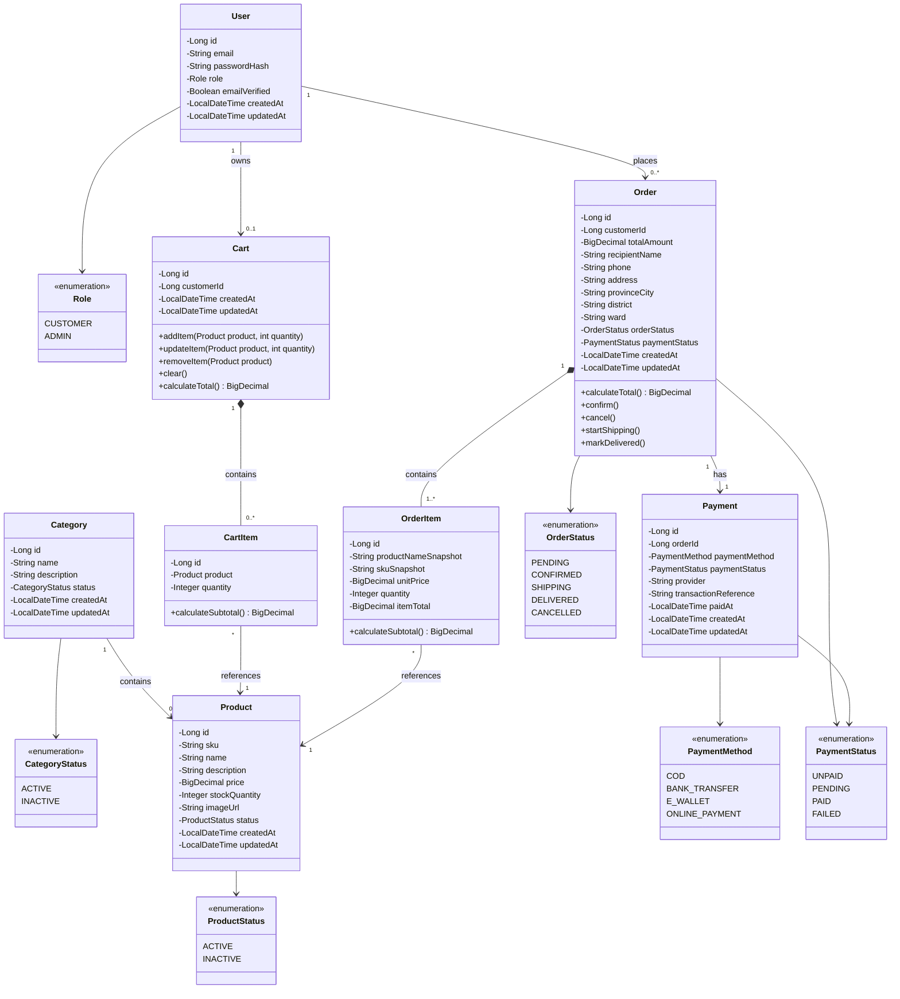

# Class Diagram

## 1. Mục đích

Tài liệu này mô tả cấu trúc các lớp chính của hệ thống Mini E-commerce dựa trên các yêu cầu đã được review và chốt trong thư mục `01-requirements`.

Class Diagram được sử dụng để:

- Mô tả các lớp chính trong hệ thống.
- Xác định thuộc tính và phương thức quan trọng của từng lớp.
- Thể hiện mối quan hệ giữa các lớp.
- Làm cơ sở cho việc triển khai Backend bằng Java Spring Boot.
- Đảm bảo thiết kế hướng đối tượng thống nhất với ERD.
- Làm rõ việc sử dụng `enum`, encapsulation và các quan hệ giữa các đối tượng.

Thiết kế tập trung vào phạm vi MVP, tránh đưa thêm các chức năng không có trong requirement.

---

## 2. Nguyên tắc thiết kế

Class Diagram được xây dựng theo các nguyên tắc sau:

### 2.1. Bám sát Requirement

Các lớp được thiết kế dựa trên các nghiệp vụ đã được xác định trong:

- `requirement-clarification.md`
- `requirement-specification.md`
- `use-cases.md`

Không tự bổ sung các nghiệp vụ ngoài phạm vi MVP.

### 2.2. Đồng bộ với ERD

Các lớp chính tương ứng với các Entity trong ERD:

| Class       | Entity tương ứng |
| ----------- | ---------------- |
| `User`      | `users`          |
| `Category`  | `categories`     |
| `Product`   | `products`       |
| `Cart`      | `carts`          |
| `CartItem`  | `cart_items`     |
| `Order`     | `orders`         |
| `OrderItem` | `order_items`    |
| `Payment`   | `payments`       |

### 2.3. Encapsulation

Các thuộc tính của class được quản lý thông qua `private` và chỉ được truy cập hoặc thay đổi thông qua các phương thức phù hợp.

Ví dụ:

```java
private BigDecimal price;
private int stockQuantity;
```

Không nên cho phép các lớp khác tùy ý thay đổi trực tiếp các thuộc tính quan trọng như giá sản phẩm hoặc số lượng tồn kho.

### 2.4. Role không sử dụng kế thừa

Hệ thống có hai nhóm tài khoản:

- `CUSTOMER`
- `ADMIN`

Tuy nhiên, `Customer` và `Admin` không được thiết kế thành hai subclass của `User`.

Thay vào đó, `User` sử dụng:

```text
Role
├── CUSTOMER
└── ADMIN
```

Lý do:

- Cả Customer và Admin đều có chung thông tin tài khoản.
- Sự khác biệt chính nằm ở quyền truy cập và nghiệp vụ được phép thực hiện.
- Không có nhóm thuộc tính riêng đủ lớn để cần tạo hai subclass.
- Tránh sử dụng inheritance không cần thiết.
- Phù hợp với cấu trúc bảng `users` trong ERD.

Việc kiểm soát quyền được thực hiện thông qua `Role` và cơ chế authorization của Spring Security.

---

# 3. Tổng quan các lớp

Hệ thống gồm các nhóm class chính:

### User Management

- `User`
- `Role`

### Product Management

- `Product`
- `Category`
- `ProductStatus`
- `CategoryStatus`

### Shopping Cart

- `Cart`
- `CartItem`

### Order Management

- `Order`
- `OrderItem`
- `OrderStatus`

### Payment

- `Payment`
- `PaymentMethod`
- `PaymentStatus`

---

# 4. Class Diagram



---

# 5. Đặc tả các Class

## 5.1. User

Đại diện cho tài khoản người dùng trong hệ thống.

### Thuộc tính

| Thuộc tính      | Kiểu dữ liệu    | Mô tả                     |
| --------------- | --------------- | ------------------------- |
| `id`            | `Long`          | ID duy nhất của tài khoản |
| `email`         | `String`        | Email đăng nhập           |
| `passwordHash`  | `String`        | Mật khẩu đã được mã hóa   |
| `role`          | `Role`          | Vai trò của tài khoản     |
| `emailVerified` | `Boolean`       | Trạng thái xác thực email |
| `createdAt`     | `LocalDateTime` | Thời gian tạo             |
| `updatedAt`     | `LocalDateTime` | Thời gian cập nhật        |

### Role

```text
CUSTOMER
ADMIN
```

`CUSTOMER` sử dụng các chức năng mua hàng.

`ADMIN` sử dụng các chức năng quản trị sản phẩm, danh mục và đơn hàng.

---

# 6. Category

Đại diện cho danh mục sản phẩm.

### Thuộc tính

| Thuộc tính    | Kiểu dữ liệu     | Mô tả               |
| ------------- | ---------------- | ------------------- |
| `id`          | `Long`           | ID danh mục         |
| `name`        | `String`         | Tên danh mục        |
| `description` | `String`         | Mô tả danh mục      |
| `status`      | `CategoryStatus` | Trạng thái danh mục |
| `createdAt`   | `LocalDateTime`  | Thời gian tạo       |
| `updatedAt`   | `LocalDateTime`  | Thời gian cập nhật  |

### CategoryStatus

```text
ACTIVE
INACTIVE
```

Danh mục `INACTIVE` không được sử dụng cho các thao tác kinh doanh mới nhưng vẫn có thể được giữ lại để bảo toàn dữ liệu.

---

# 7. Product

Đại diện cho sản phẩm được bán trên hệ thống.

### Thuộc tính

| Thuộc tính      | Kiểu dữ liệu    | Mô tả                |
| --------------- | --------------- | -------------------- |
| `id`            | `Long`          | ID sản phẩm          |
| `sku`           | `String`        | Mã sản phẩm duy nhất |
| `name`          | `String`        | Tên sản phẩm         |
| `description`   | `String`        | Mô tả sản phẩm       |
| `price`         | `BigDecimal`    | Giá sản phẩm         |
| `stockQuantity` | `Integer`       | Số lượng tồn kho     |
| `imageUrl`      | `String`        | URL hình ảnh         |
| `status`        | `ProductStatus` | Trạng thái sản phẩm  |
| `createdAt`     | `LocalDateTime` | Thời gian tạo        |
| `updatedAt`     | `LocalDateTime` | Thời gian cập nhật   |

### ProductStatus

```text
ACTIVE
INACTIVE
```

Sản phẩm `INACTIVE` không được hiển thị hoặc sử dụng cho các thao tác mua hàng mới.

---

# 8. Cart

Đại diện cho giỏ hàng của Customer đã đăng nhập.

Một Customer có tối đa một Cart đang hoạt động.

### Thuộc tính

| Thuộc tính   | Kiểu dữ liệu    | Mô tả                       |
| ------------ | --------------- | --------------------------- |
| `id`         | `Long`          | ID giỏ hàng                 |
| `customerId` | `Long`          | ID Customer sở hữu giỏ hàng |
| `createdAt`  | `LocalDateTime` | Thời gian tạo               |
| `updatedAt`  | `LocalDateTime` | Thời gian cập nhật          |

### Phương thức chính

| Phương thức        | Mô tả                          |
| ------------------ | ------------------------------ |
| `addItem()`        | Thêm sản phẩm vào giỏ          |
| `updateItem()`     | Cập nhật số lượng sản phẩm     |
| `removeItem()`     | Xóa sản phẩm khỏi giỏ          |
| `clear()`          | Xóa toàn bộ sản phẩm trong giỏ |
| `calculateTotal()` | Tính tổng giá trị giỏ hàng     |

---

# 9. CartItem

Đại diện cho một sản phẩm trong giỏ hàng.

### Thuộc tính

| Thuộc tính | Kiểu dữ liệu | Mô tả        |
| ---------- | ------------ | ------------ |
| `id`       | `Long`       | ID Cart Item |
| `product`  | `Product`    | Sản phẩm     |
| `quantity` | `Integer`    | Số lượng     |

### Phương thức

```text
calculateSubtotal()
```

Tính:

```text
subtotal = product.price × quantity
```

Một sản phẩm chỉ xuất hiện một lần trong cùng một Cart. Nếu Customer thêm lại sản phẩm đã có, hệ thống cập nhật `quantity` thay vì tạo thêm một `CartItem`.

---

# 10. Order

Đại diện cho đơn hàng được tạo sau khi Customer checkout.

### Thuộc tính

| Thuộc tính      | Kiểu dữ liệu    | Mô tả                 |
| --------------- | --------------- | --------------------- |
| `id`            | `Long`          | ID đơn hàng           |
| `customerId`    | `Long`          | Customer tạo đơn      |
| `totalAmount`   | `BigDecimal`    | Tổng giá trị đơn hàng |
| `recipientName` | `String`        | Tên người nhận        |
| `phone`         | `String`        | Số điện thoại         |
| `address`       | `String`        | Địa chỉ               |
| `provinceCity`  | `String`        | Tỉnh/thành phố        |
| `district`      | `String`        | Quận/huyện            |
| `ward`          | `String`        | Phường/xã             |
| `orderStatus`   | `OrderStatus`   | Trạng thái đơn hàng   |
| `paymentStatus` | `PaymentStatus` | Trạng thái thanh toán |
| `createdAt`     | `LocalDateTime` | Thời gian tạo         |
| `updatedAt`     | `LocalDateTime` | Thời gian cập nhật    |

### Phương thức

| Phương thức        | Mô tả                            |
| ------------------ | -------------------------------- |
| `calculateTotal()` | Tính tổng tiền đơn hàng          |
| `confirm()`        | Xác nhận đơn hàng                |
| `cancel()`         | Hủy đơn hàng                     |
| `startShipping()`  | Chuyển sang trạng thái đang giao |
| `markDelivered()`  | Đánh dấu đã giao hàng            |

---

# 11. OrderStatus

Trạng thái của đơn hàng:

```text
PENDING
CONFIRMED
SHIPPING
DELIVERED
CANCELLED
```

Luồng trạng thái chính:

```text
PENDING
   ├──> CONFIRMED
   │       └──> SHIPPING
   │               └──> DELIVERED
   │
   └──> CANCELLED
```

Không cho phép chuyển trạng thái tùy ý.

Ví dụ:

- `PENDING` → `CONFIRMED`: hợp lệ.
- `PENDING` → `CANCELLED`: hợp lệ.
- `CONFIRMED` → `SHIPPING`: hợp lệ.
- `SHIPPING` → `DELIVERED`: hợp lệ.
- `DELIVERED` → `PENDING`: không hợp lệ.
- `CANCELLED` → `CONFIRMED`: không hợp lệ.

---

# 12. OrderItem

Đại diện cho một sản phẩm tại thời điểm đơn hàng được tạo.

Khác với `CartItem`, `OrderItem` lưu thông tin snapshot của sản phẩm.

### Thuộc tính

| Thuộc tính            | Kiểu dữ liệu | Mô tả                               |
| --------------------- | ------------ | ----------------------------------- |
| `id`                  | `Long`       | ID Order Item                       |
| `productNameSnapshot` | `String`     | Tên sản phẩm tại thời điểm đặt hàng |
| `skuSnapshot`         | `String`     | SKU tại thời điểm đặt hàng          |
| `unitPrice`           | `BigDecimal` | Giá tại thời điểm đặt hàng          |
| `quantity`            | `Integer`    | Số lượng                            |
| `itemTotal`           | `BigDecimal` | Thành tiền                          |

### Công thức

```text
itemTotal = unitPrice × quantity
```

Việc lưu snapshot giúp bảo toàn lịch sử đơn hàng.

Ví dụ:

```text
Ngày 01:
Product A
Price = 100.000 VNĐ

Customer đặt hàng:
OrderItem.unitPrice = 100.000 VNĐ

Ngày 05:
Product A được đổi giá thành 120.000 VNĐ
```

Đơn hàng cũ vẫn giữ giá `100.000 VNĐ`.

---

# 13. Payment

Đại diện cho thông tin thanh toán của một đơn hàng.

Một Order có tối đa một Payment tương ứng trong phạm vi MVP.

### Thuộc tính

| Thuộc tính             | Kiểu dữ liệu    | Mô tả                          |
| ---------------------- | --------------- | ------------------------------ |
| `id`                   | `Long`          | ID thanh toán                  |
| `orderId`              | `Long`          | ID đơn hàng                    |
| `paymentMethod`        | `PaymentMethod` | Phương thức thanh toán         |
| `paymentStatus`        | `PaymentStatus` | Trạng thái thanh toán          |
| `provider`             | `String`        | Nhà cung cấp thanh toán nếu có |
| `transactionReference` | `String`        | Mã giao dịch                   |
| `paidAt`               | `LocalDateTime` | Thời gian thanh toán           |
| `createdAt`            | `LocalDateTime` | Thời gian tạo                  |
| `updatedAt`            | `LocalDateTime` | Thời gian cập nhật             |

---

# 14. PaymentMethod

Các phương thức thanh toán được hỗ trợ trong thiết kế hiện tại:

```text
COD
BANK_TRANSFER
E_WALLET
ONLINE_PAYMENT
```

Trong đó:

- `COD`: Thanh toán khi nhận hàng.
- `BANK_TRANSFER`: Chuyển khoản ngân hàng.
- `E_WALLET`: Ví điện tử.
- `ONLINE_PAYMENT`: Thanh toán trực tuyến.

Nếu requirement cuối cùng chỉ xác nhận một phương thức `COD`, class `Payment` và enum `PaymentMethod` có thể được đơn giản hóa trong quá trình implementation.

---

# 15. PaymentStatus

Trạng thái thanh toán:

```text
UNPAID
PENDING
PAID
FAILED
```

Ví dụ với COD:

```text
UNPAID
   ↓
PAID
```

Trạng thái `PAID` được cập nhật khi hệ thống xác định khoản thanh toán đã hoàn tất.

---

# 16. Quan hệ giữa các Class

## 16.1. User - Cart

```text
User 1 -------- 0..1 Cart
```

Một Customer có tối đa một giỏ hàng.

Admin không sử dụng Cart để mua hàng.

---

## 16.2. User - Order

```text
User 1 -------- 0..* Order
```

Một Customer có thể tạo nhiều đơn hàng.

Một Order thuộc về một Customer.

---

## 16.3. Category - Product

```text
Category 1 -------- 0..* Product
```

Một Category có thể chứa nhiều Product.

Mỗi Product thuộc một Category trong phạm vi thiết kế MVP hiện tại.

---

## 16.4. Cart - CartItem

```text
Cart 1 -------- 0..* CartItem
```

Một Cart có thể chứa nhiều CartItem.

Khi Cart bị xóa, các CartItem thuộc Cart cũng được xử lý theo quan hệ composition.

---

## 16.5. CartItem - Product

```text
CartItem * -------- 1 Product
```

Mỗi CartItem tham chiếu đến một Product.

Một Product có thể xuất hiện trong nhiều Cart khác nhau.

---

## 16.6. Order - OrderItem

```text
Order 1 -------- 1..* OrderItem
```

Một Order phải có ít nhất một OrderItem.

Một OrderItem chỉ thuộc về một Order.

---

## 16.7. OrderItem - Product

```text
OrderItem * -------- 1 Product
```

OrderItem tham chiếu đến Product gốc nhưng đồng thời lưu snapshot của thông tin quan trọng.

Điều này giúp lịch sử đơn hàng không bị ảnh hưởng khi Product được chỉnh sửa sau này.

---

## 16.8. Order - Payment

```text
Order 1 -------- 0..1 Payment
```

Một Order có tối đa một Payment trong phạm vi MVP.

---

# 17. Inheritance và Polymorphism

## 17.1. Không sử dụng Inheritance cho User Role

Không thiết kế:

```text
User
├── Customer
└── Admin
```

mà sử dụng:

```text
User
  |
  +-- Role.CUSTOMER
  |
  +-- Role.ADMIN
```

Đây là lựa chọn phù hợp hơn với hệ thống hiện tại vì Customer và Admin có cùng cấu trúc tài khoản.

---

## 17.2. Không lạm dụng Polymorphism

MVP hiện tại chưa có các đối tượng có hành vi khác biệt đủ lớn để cần xây dựng hierarchy bằng interface hoặc abstract class.

Ví dụ không cần tạo:

```text
Payment
├── CODPayment
├── BankTransferPayment
├── EWalletPayment
└── OnlinePayment
```

ở giai đoạn hiện tại.

Thay vào đó:

```text
Payment
    |
    +-- PaymentMethod
```

được sử dụng để xác định phương thức thanh toán.

Nếu hệ thống trong tương lai tích hợp nhiều payment gateway với các quy trình xử lý hoàn toàn khác nhau, có thể refactor sang Strategy Pattern hoặc một interface như:

```java
interface PaymentProcessor {
    PaymentResult process(Payment payment);
}
```

Tuy nhiên, đây chưa phải yêu cầu của MVP.

---

# 18. Các nguyên tắc OOP được áp dụng

## Encapsulation

Các thuộc tính quan trọng được khai báo `private`.

Ví dụ:

```java
private BigDecimal price;
private Integer stockQuantity;
```

Việc thay đổi dữ liệu phải đi qua các phương thức nghiệp vụ phù hợp.

---

## Association

Ví dụ:

```text
CartItem → Product
OrderItem → Product
Order → Payment
```

Các đối tượng có liên hệ với nhau nhưng không nhất thiết có vòng đời phụ thuộc hoàn toàn.

---

## Composition

Composition được sử dụng cho các thành phần phụ thuộc vào đối tượng cha.

Ví dụ:

```text
Cart *-- CartItem
Order *-- OrderItem
```

`CartItem` tồn tại như một phần của `Cart`.

`OrderItem` tồn tại như một phần của `Order`.

---

## Enum

Các trạng thái có tập giá trị cố định được biểu diễn bằng `enum`.

Ví dụ:

```java
enum Role {
    CUSTOMER,
    ADMIN
}
```

và:

```java
enum OrderStatus {
    PENDING,
    CONFIRMED,
    SHIPPING,
    DELIVERED,
    CANCELLED
}
```

Điều này giúp hạn chế giá trị không hợp lệ và làm rõ domain model.

---

# 19. Domain Rules quan trọng

Class Diagram không chỉ mô tả cấu trúc dữ liệu mà còn phải phản ánh một số business rule quan trọng.

### Product

```text
price >= 0
stockQuantity >= 0
sku không được trùng
```

### CartItem

```text
quantity > 0
```

Không được thêm số lượng vượt quá tồn kho.

### OrderItem

```text
quantity > 0
unitPrice >= 0
itemTotal = unitPrice × quantity
```

### Order

```text
totalAmount = tổng itemTotal của các OrderItem
```

### Order Status

Chỉ cho phép chuyển trạng thái theo flow được định nghĩa.

### Payment

Một Order không được có nhiều Payment active trong phạm vi MVP.

---

# 20. Mapping với Backend Spring Boot

Các class domain chính có thể được triển khai dưới dạng JPA Entity:

```text
entity/
├── User.java
├── Category.java
├── Product.java
├── Cart.java
├── CartItem.java
├── Order.java
├── OrderItem.java
└── Payment.java
```

Các enum:

```text
entity/enums/
├── Role.java
├── CategoryStatus.java
├── ProductStatus.java
├── OrderStatus.java
├── PaymentMethod.java
└── PaymentStatus.java
```

Service layer có thể được tổ chức tương ứng với các nhóm nghiệp vụ:

```text
service/
├── UserService.java
├── ProductService.java
├── CategoryService.java
├── CartService.java
├── OrderService.java
└── PaymentService.java
```

Repository:

```text
repository/
├── UserRepository.java
├── CategoryRepository.java
├── ProductRepository.java
├── CartRepository.java
├── CartItemRepository.java
├── OrderRepository.java
├── OrderItemRepository.java
└── PaymentRepository.java
```

Các class này là định hướng tổ chức code cho Backend, không phải yêu cầu bắt buộc phải triển khai toàn bộ ngay từ đầu.

---

# 21. Những thành phần chưa đưa vào Class Diagram

Để giữ phạm vi MVP, các class sau chưa được đưa vào:

- `Address`
- `Coupon`
- `Review`
- `Wishlist`
- `ProductImage`
- `InventoryTransaction`
- `RefreshToken`
- `Notification`
- `PaymentGateway`
- `ShippingProvider`

Nếu các chức năng tương ứng được bổ sung trong requirement ở các giai đoạn sau, Class Diagram có thể được mở rộng.

---

# 22. Tính nhất quán với ERD

Class Diagram và ERD sử dụng cùng một mô hình domain chính:

```text
User
 │
 ├── Cart
 │    └── CartItem ── Product ── Category
 │
 └── Order
      ├── OrderItem ── Product
      └── Payment
```

Trong đó:

- `User` quản lý tài khoản và vai trò.
- `Category` quản lý nhóm sản phẩm.
- `Product` quản lý thông tin và tồn kho.
- `Cart` và `CartItem` quản lý giỏ hàng.
- `Order` và `OrderItem` quản lý đơn hàng.
- `Payment` quản lý thông tin thanh toán.
- Các `enum` quản lý role, trạng thái và phương thức thanh toán.

Thiết kế này đảm bảo Class Diagram có thể ánh xạ tương đối trực tiếp xuống ERD và thuận lợi cho việc triển khai bằng Spring Boot + JPA.

---

# 23. Kết luận

Class Diagram của Mini E-commerce tập trung vào các đối tượng cốt lõi của hệ thống và giữ phạm vi phù hợp với MVP.

Các nguyên tắc chính:

- Bám sát requirement đã được review và chốt.
- Đồng bộ với ERD.
- Áp dụng Encapsulation.
- Sử dụng `enum` cho các tập giá trị cố định.
- Sử dụng Composition cho `CartItem` và `OrderItem`.
- Không sử dụng inheritance cho `Customer` và `Admin` khi chưa cần thiết.
- Không lạm dụng Polymorphism hoặc Design Pattern khi requirement chưa yêu cầu.
- Giữ thiết kế đủ đơn giản để có thể triển khai và kiểm thử trong phạm vi dự án.

Class Diagram này sẽ là cơ sở cho các bước tiếp theo như thiết kế API, cấu trúc Backend Spring Boot và triển khai Database.
