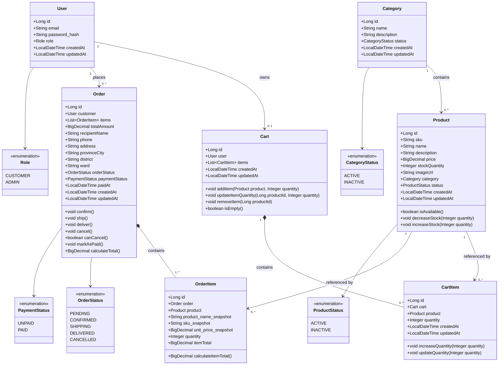

# Class Diagram

## 1. Information

| Item | Description |
|---|---|
| Project | Mini E-commerce / Inventory Management |
| Document | Class Diagram |
| Status | Revised after Review Round 2 |
| Backend | Java Spring Boot |
| Database | MySQL |

* * *

# 2. Purpose

Class Diagram mô tả cấu trúc các class chính của hệ thống Mini E-commerce / Inventory Management.

Class Diagram được xây dựng dựa trên:

* Requirement Specification.
* Entity Relationship Diagram.
* Các business rules của MVP.
* REST API design.

Mục tiêu của Class Diagram là xác định:

* Domain entities.
* Attributes.
* Relationships.
* Business behavior quan trọng.
* Service responsibilities.
* Enum/constant được sử dụng trong hệ thống.

Thiết kế tập trung vào các nghiệp vụ:

```text
Authentication
Product Management
Category Management
Shopping Cart
Checkout
Order Management
Inventory Management
```

* * *

# 3. Class Diagram Overview


```mermaid
classDiagram

    class User {
        +Long id
        +String email
        +String password_hash
        +Role role
        +LocalDateTime createdAt
        +LocalDateTime updatedAt
    }

    class Category {
        +Long id
        +String name
        +String description
        +CategoryStatus status
        +LocalDateTime createdAt
        +LocalDateTime updatedAt
    }

    class Product {
        +Long id
        +String sku
        +String name
        +String description
        +BigDecimal price
        +Integer stockQuantity
        +String imageUrl
        +Category category
        +ProductStatus status
        +LocalDateTime createdAt
        +LocalDateTime updatedAt
        +boolean isAvailable()
        +void decreaseStock(Integer quantity)
        +void increaseStock(Integer quantity)
    }

    class Cart {
        +Long id
        +User user
        +List~CartItem~ items
        +LocalDateTime createdAt
        +LocalDateTime updatedAt
        +void addItem(Product product, Integer quantity)
        +void updateItemQuantity(Long productId, Integer quantity)
        +void removeItem(Long productId)
        +boolean isEmpty()
    }

    class CartItem {
        +Long id
        +Cart cart
        +Product product
        +Integer quantity
        +LocalDateTime createdAt
        +LocalDateTime updatedAt
        +void increaseQuantity(Integer quantity)
        +void updateQuantity(Integer quantity)
    }

    class Order {
        +Long id
        +User customer
        +List~OrderItem~ items
        +BigDecimal totalAmount
        +String recipientName
        +String phone
        +String address
        +String provinceCity
        +String district
        +String ward
        +OrderStatus orderStatus
        +PaymentStatus paymentStatus
        +LocalDateTime paidAt
        +LocalDateTime createdAt
        +LocalDateTime updatedAt
        +void confirm()
        +void ship()
        +void deliver()
        +void cancel()
        +boolean canCancel()
        +void markAsPaid()
        +BigDecimal calculateTotal()
    }

    class OrderItem {
        +Long id
        +Order order
        +Product product
        +String product_name_snapshot
        +String sku_snapshot
        +BigDecimal unit_price_snapshot
        +Integer quantity
        +BigDecimal itemTotal
        +BigDecimal calculateItemTotal()
    }

    class Role {
        <<enumeration>>
        CUSTOMER
        ADMIN
    }

    class ProductStatus {
        <<enumeration>>
        ACTIVE
        INACTIVE
    }

    class CategoryStatus {
        <<enumeration>>
        ACTIVE
        INACTIVE
    }

    class OrderStatus {
        <<enumeration>>
        PENDING
        CONFIRMED
        SHIPPING
        DELIVERED
        CANCELLED
    }

    class PaymentStatus {
        <<enumeration>>
        UNPAID
        PAID
    }

    User "1" --> "0..1" Cart : owns
    User "1" --> "0..*" Order : places

    Category "1" --> "0..*" Product : contains

    Cart "1" *-- "0..*" CartItem : contains
    Product "1" --> "0..*" CartItem : referenced by

    Order "1" *-- "1..*" OrderItem : contains
    Product "1" --> "0..*" OrderItem : referenced by

    User --> Role
    Product --> ProductStatus
    Category --> CategoryStatus
    Order --> OrderStatus
    Order --> PaymentStatus
```

* * *

# 4. Domain Classes

## 4.1. User

`User` đại diện cho tài khoản Customer hoặc Admin.

### Attributes

| Attribute | Type | Description |
|---|---|---|
| `id` | Long | User ID |
| `email` | String | Email đăng nhập |
| `password_hash` | String | Password đã hash |
| `role` | Role | `CUSTOMER` hoặc `ADMIN` |
| `createdAt` | LocalDateTime | Thời điểm tạo |
| `updatedAt` | LocalDateTime | Thời điểm cập nhật |

### Business Rules

* `email` phải unique.
* Password không được lưu plain text.
* Password phải được hash trước khi lưu.
* Public registration chỉ tạo `CUSTOMER`.
* `ADMIN` được tạo thông qua seed/migration.
* MVP không có `accountStatus`.

### Relationships

```text
User 1 ───── 0..1 Cart
User 1 ───── 0..N Order
```

Một User có thể chưa có Cart hoặc Order.

Customer tối đa có một Cart active.

* * *

## 4.2. Category

`Category` đại diện cho danh mục sản phẩm.

### Attributes

| Attribute | Type | Description |
|---|---|---|
| `id` | Long | Category ID |
| `name` | String | Category Name |
| `description` | String | Mô tả |
| `status` | CategoryStatus | ACTIVE / INACTIVE |
| `createdAt` | LocalDateTime | Thời điểm tạo |
| `updatedAt` | LocalDateTime | Thời điểm cập nhật |

### Business Rules

* `name` phải unique.
* Category không có hierarchy.
* Category có thể ACTIVE hoặc INACTIVE.
* Không được xóa Category khi còn Product tham chiếu.
* Có thể chuyển Category sang `INACTIVE` để ẩn.

### Relationships

```text
Category 1 ───── 0..N Product
```

* * *

## 4.3. Product

`Product` đại diện cho sản phẩm được bán trong hệ thống.

### Attributes

| Attribute | Type | Description |
|---|---|---|
| `id` | Long | Product ID |
| `sku` | String | SKU duy nhất |
| `name` | String | Product Name |
| `description` | String | Mô tả |
| `price` | BigDecimal | Giá sản phẩm |
| `stockQuantity` | Integer | Tồn kho |
| `imageUrl` | String | URL ảnh chính |
| `category` | Category | Category của Product |
| `status` | ProductStatus | ACTIVE / INACTIVE |
| `createdAt` | LocalDateTime | Thời điểm tạo |
| `updatedAt` | LocalDateTime | Thời điểm cập nhật |

### Business Rules

* `sku` phải unique.
* `price > 0`.
* `stockQuantity >= 0`.
* Product phải thuộc một Category.
* Product `INACTIVE` không được mua.
* Product có `stockQuantity = 0` là Out of Stock.
* Delete Product là Soft Delete bằng cách chuyển `status = INACTIVE`.

### Domain Behavior

#### `isAvailable()`

Product được xem là khả dụng khi:

```text
status = ACTIVE
AND
stockQuantity > 0
```

#### `decreaseStock(quantity)`

Giảm tồn kho khi Checkout thành công.

Điều kiện:

```text
quantity > 0
stockQuantity >= quantity
```

Không cho phép kết quả:

```text
stockQuantity < 0
```

#### `increaseStock(quantity)`

Tăng tồn kho khi Order được Cancel hợp lệ.

Điều kiện:

```text
quantity > 0
```

### Relationships

```text
Category 1 ───── 0..N Product
Product 1 ───── 0..N CartItem
Product 1 ───── 0..N OrderItem
```

* * *

# 5. Cart Classes

## 5.1. Cart

`Cart` đại diện cho giỏ hàng của Customer.

### Attributes

| Attribute | Type | Description |
|---|---|---|
| `id` | Long | Cart ID |
| `user` | User | Customer sở hữu Cart |
| `items` | List<CartItem> | Danh sách CartItem |
| `createdAt` | LocalDateTime | Thời điểm tạo |
| `updatedAt` | LocalDateTime | Thời điểm cập nhật |

### Business Rules

* Một Customer tối đa có một Cart.
* Cart chỉ tồn tại cho Customer đã đăng nhập.
* Guest không có Cart persistent.
* Cart có thể rỗng.
* Một Product chỉ xuất hiện một lần trong cùng Cart.

### Domain Behavior

#### `addItem(product, quantity)`

Nếu Product chưa tồn tại:

```text
Create CartItem
```

Nếu Product đã tồn tại:

```text
Increase existing quantity
```

Quantity phải được validate với Stock hiện tại.

#### `updateItemQuantity(productId, quantity)`

Cập nhật Quantity của CartItem.

Quantity phải:

```text
> 0
AND
<= current stock
```

#### `removeItem(productId)`

Xóa CartItem khỏi Cart.

#### `isEmpty()`

Trả về `true` nếu Cart không có CartItem.

### Relationships

```text
User 1 ───── 0..1 Cart

Cart 1 *──── 0..N CartItem
```

Composition được sử dụng giữa Cart và CartItem vì CartItem thuộc về Cart.

* * *

## 5.2. CartItem

`CartItem` đại diện cho một Product và Quantity trong Cart.

### Attributes

| Attribute | Type | Description |
|---|---|---|
| `id` | Long | CartItem ID |
| `cart` | Cart | Cart sở hữu |
| `product` | Product | Product |
| `quantity` | Integer | Số lượng |
| `createdAt` | LocalDateTime | Thời điểm tạo |
| `updatedAt` | LocalDateTime | Thời điểm cập nhật |

### Business Rules

* `quantity > 0`.
* `(cart, product)` phải unique.
* Quantity không được vượt quá Stock hiện tại khi thao tác Add/Update Cart.

### Domain Behavior

#### `increaseQuantity(quantity)`

Tăng Quantity.

#### `updateQuantity(quantity)`

Cập nhật Quantity mới.

Validation Stock được thực hiện ở application/service layer kết hợp với dữ liệu Product hiện tại.

* * *

# 6. Order Classes

## 6.1. Order

`Order` đại diện cho đơn hàng của Customer.

### Attributes

| Attribute | Type | Description |
|---|---|---|
| `id` | Long | Order ID |
| `customer` | User | Customer tạo Order |
| `items` | List<OrderItem> | Danh sách OrderItem |
| `totalAmount` | BigDecimal | Tổng tiền |
| `recipientName` | String | Tên người nhận |
| `phone` | String | Số điện thoại |
| `address` | String | Địa chỉ |
| `provinceCity` | String | Tỉnh/Thành phố |
| `district` | String | Quận/Huyện |
| `ward` | String | Phường/Xã |
| `orderStatus` | OrderStatus | Trạng thái Order |
| `paymentStatus` | PaymentStatus | Trạng thái Payment |
| `paidAt` | LocalDateTime | Thời điểm thanh toán |
| `createdAt` | LocalDateTime | Thời điểm tạo |
| `updatedAt` | LocalDateTime | Thời điểm cập nhật |

### Initial State

Khi Order được tạo:

```text
orderStatus   = PENDING
paymentStatus = UNPAID
paidAt        = NULL
```

### Order Status Transition

```text
PENDING
   ├──→ CONFIRMED
   │       ↓
   │    SHIPPING
   │       ↓
   │    DELIVERED
   │
   └──→ CANCELLED
```

Chỉ các transition sau được phép:

```text
PENDING → CONFIRMED
PENDING → CANCELLED
CONFIRMED → SHIPPING
SHIPPING → DELIVERED
```

### Payment State

Khi:

```text
SHIPPING → DELIVERED
```

hệ thống tự động:

```text
paymentStatus = PAID
paidAt = current timestamp
```

Với các trạng thái khác `DELIVERED`:

```text
paymentStatus = UNPAID
paidAt = NULL
```

### Domain Behavior

#### `confirm()`

```text
PENDING → CONFIRMED
```

Chỉ được gọi khi Order đang `PENDING`.

#### `ship()`

```text
CONFIRMED → SHIPPING
```

Chỉ được gọi khi Order đang `CONFIRMED`.

#### `deliver()`

```text
SHIPPING → DELIVERED
```

Khi thành công:

```text
orderStatus = DELIVERED
paymentStatus = PAID
paidAt = current timestamp
```

#### `cancel()`

```text
PENDING → CANCELLED
```

Chỉ được gọi khi Order đang `PENDING`.

Việc restore Stock phải được thực hiện trong cùng transaction ở application/service layer.

#### `canCancel()`

Trả về `true` khi:

```text
orderStatus = PENDING
```

#### `markAsPaid()`

Chỉ được thực hiện theo business rule khi Order chuyển sang `DELIVERED`.

#### `calculateTotal()`

Tính:

```text
Order Total = Σ OrderItem.itemTotal
```

`totalAmount` không được lấy trực tiếp từ Client.

* * *

## 6.2. OrderItem

`OrderItem` đại diện cho một Product trong Order và lưu snapshot dữ liệu tại thời điểm mua.

### Attributes

| Attribute | Type | Description |
|---|---|---|
| `id` | Long | OrderItem ID |
| `order` | Order | Order |
| `product` | Product | Product reference |
| `product_name_snapshot` | String | Product Name snapshot |
| `sku_snapshot` | String | SKU snapshot |
| `unit_price_snapshot` | BigDecimal | Giá tại thời điểm mua |
| `quantity` | Integer | Số lượng |
| `itemTotal` | BigDecimal | Thành tiền |

### Business Rules

* `quantity > 0`.
* `unit_price_snapshot > 0`.
* `itemTotal >= 0`.
* Product Name, SKU và Unit Price phải được snapshot tại thời điểm Checkout.
* Thay đổi Product sau này không được làm thay đổi OrderItem cũ.

### Domain Behavior

#### `calculateItemTotal()`

```text
itemTotal = unit_price_snapshot × quantity
```

* * *

# 7. Enumerations

## 7.1. Role

```text
CUSTOMER
ADMIN
```

`Role` xác định quyền truy cập hệ thống.

Guest không phải một Role trong Database.

* * *

## 7.2. ProductStatus

```text
ACTIVE
INACTIVE
```

* `ACTIVE`: Product có thể được mua nếu còn Stock.
* `INACTIVE`: Product không được mua.

* * *

## 7.3. CategoryStatus

```text
ACTIVE
INACTIVE
```

* `ACTIVE`: Category đang được sử dụng.
* `INACTIVE`: Category bị ẩn khỏi public view.

* * *

## 7.4. OrderStatus

```text
PENDING
CONFIRMED
SHIPPING
DELIVERED
CANCELLED
```

* * *

## 7.5. PaymentStatus

```text
UNPAID
PAID
```

MVP không có Payment class/entity riêng.

* * *

# 8. Service Layer

Business logic phức tạp không nên được đặt toàn bộ trong Entity.

Application Service/Domain Service chịu trách nhiệm phối hợp nhiều Entity và Transaction.

Các Service chính:

```text
AuthService
ProductService
CategoryService
CartService
OrderService
AdminOrderService
```

* * *

## 8.1. AuthService

Responsibilities:

* Register Customer.
* Login Customer/Admin.
* Password hashing.
* JWT generation.
* Authentication validation.

Ví dụ:

```text
+ register(email, password_hash)
+ login(email, password_hash)
+ generateToken(user)
```

* * *

## 8.2. ProductService

Responsibilities:

* View Product.
* Search Product.
* Filter Product.
* Sort Product.
* Create Product.
* Update Product.
* Soft Delete Product.
* Activate/Deactivate Product.
* Manage Stock.

Ví dụ:

```text
+ getProducts(...)
+ getProductById(id)
+ createProduct(...)
+ updateProduct(id, ...)
+ deactivateProduct(id)
+ activateProduct(id)
+ updateStock(id, quantity)
```

* * *

## 8.3. CategoryService

Responsibilities:

* View Categories.
* Create Category.
* Update Category.
* Delete Category.
* Activate/Deactivate Category.

Khi Delete Category:

```text
if category has referenced products:
    reject with conflict
else:
    delete according to persistence strategy
```

Category đang được Product tham chiếu không được xóa.

* * *

## 8.4. CartService

Responsibilities:

* Get Customer Cart.
* Add Product.
* Update Quantity.
* Remove CartItem.
* Validate Cart availability.

Ví dụ:

```text
+ getCart(customerId)
+ addItem(customerId, productId, quantity)
+ updateItemQuantity(customerId, productId, quantity)
+ removeItem(customerId, productId)
+ validateCart(customerId)
```

CartService phải kiểm tra:

* Product Status.
* Stock.
* Quantity.
* Cart ownership.

* * *

## 8.5. OrderService

Responsibilities:

* Checkout.
* Create Order.
* Create OrderItems.
* Calculate Total.
* Deduct Stock.
* Clear Cart.
* Customer Order History.
* Customer Order Detail.
* Customer Cancel Order.

Ví dụ:

```text
+ checkout(customerId, shippingInformation)
+ getMyOrders(customerId, ...)
+ getMyOrderDetail(customerId, orderId)
+ cancelOrder(customerId, orderId)
```

### Checkout Transaction

```text
BEGIN TRANSACTION

Validate Customer
       ↓
Validate Cart
       ↓
Validate Products
       ↓
Validate Stock
       ↓
Create Order
       ↓
Create OrderItems
       ↓
Conditional Stock Deduction
       ↓
Clear Cart

COMMIT
```

Nếu bất kỳ bước nào thất bại:

```text
ROLLBACK
```

* * *

## 8.6. AdminOrderService

Responsibilities:

* View All Orders.
* Search Orders.
* Filter Orders.
* View Order Detail.
* Update Order Status.
* Cancel Pending Order.
* Restore Stock.
* Automatically mark Payment as PAID when delivered.

Ví dụ:

```text
+ getOrders(...)
+ getOrderDetail(orderId)
+ updateOrderStatus(orderId, newStatus)
```

### Admin Cancel Transaction

```text
BEGIN TRANSACTION

Validate Order = PENDING
       ↓
Order = CANCELLED
       ↓
Restore Stock

COMMIT
```

Không được restore Stock lần thứ hai.

### Delivery Transaction

Khi:

```text
SHIPPING → DELIVERED
```

Service phải đảm bảo:

```text
orderStatus = DELIVERED
paymentStatus = PAID
paidAt = current timestamp
```

* * *

# 9. Controller Layer

REST Controller chịu trách nhiệm nhận HTTP Request và trả HTTP Response.

Controllers chính:

```text
AuthController
ProductController
CategoryController
CartController
OrderController
AdminProductController
AdminCategoryController
AdminOrderController
```

* * *

## 9.1. AuthController

```text
POST /api/auth/register
POST /api/auth/login
```

* * *

## 9.2. ProductController

```text
GET /api/products
GET /api/products/{id}
```

Public Product API chỉ hiển thị Product `ACTIVE` trong Product List.

Product Detail có thể trả Product `INACTIVE` với trạng thái không khả dụng.

* * *

## 9.3. CategoryController

```text
GET /api/categories
GET /api/categories/{id}
```

* * *

## 9.4. CartController

```text
GET /api/cart
POST /api/cart/items
PUT /api/cart/items/{productId}
DELETE /api/cart/items/{productId}
```

Các API này yêu cầu Customer authentication.

* * *

## 9.5. OrderController

```text
POST /api/orders/checkout
GET /api/orders/my
GET /api/orders/{id}
PATCH /api/orders/{id}/cancel
```

Customer chỉ được truy cập Order của chính mình.

* * *

## 9.6. AdminProductController

```text
GET /api/admin/products
GET /api/admin/products/{id}
POST /api/admin/products
PUT /api/admin/products/{id}
DELETE /api/admin/products/{id}
```

Yêu cầu role:

```text
ADMIN
```

* * *

## 9.7. AdminCategoryController

```text
GET /api/admin/categories
POST /api/admin/categories
PUT /api/admin/categories/{id}
DELETE /api/admin/categories/{id}
```

Yêu cầu role:

```text
ADMIN
```

* * *

## 9.8. AdminOrderController

```text
GET /api/admin/orders
GET /api/admin/orders/{id}
PATCH /api/admin/orders/{id}/status
```

Yêu cầu role:

```text
ADMIN
```

* * *

# 10. DTO Layer

Entity không nên được expose trực tiếp qua REST API.

Hệ thống sử dụng DTO để:

* Validate Request.
* Kiểm soát Response.
* Không expose sensitive fields.
* Tách API contract khỏi Database Entity.

Các DTO chính:

```text
RegisterRequest
LoginRequest
LoginResponse

ProductRequest
ProductResponse
ProductListResponse

CategoryRequest
CategoryResponse

CartResponse
CartItemResponse

CheckoutRequest
OrderResponse
OrderItemResponse

AdminOrderResponse
UpdateOrderStatusRequest
```

* * *

# 11. Important DTO Rules

## 11.1. CheckoutRequest

Client chỉ được gửi:

```text
recipientName
phone
address
provinceCity
district
ward
```

Client không được quyết định:

```text
customerId
totalAmount
orderStatus
paymentStatus
paidAt
unit_price_snapshot
```

Backend phải lấy Customer từ authenticated JWT và tính các giá trị còn lại.

* * *

## 11.2. UpdateOrderStatusRequest

Client/Admin chỉ gửi trạng thái mới:

```text
newStatus
```

Backend phải:

1. Kiểm tra quyền Admin.
2. Load Order.
3. Kiểm tra transition hợp lệ.
4. Thực hiện business logic tương ứng.
5. Commit transaction.

* * *

# 12. Repository Layer

Repository chịu trách nhiệm truy cập Database.

Các Repository chính:

```text
UserRepository
CategoryRepository
ProductRepository
CartRepository
CartItemRepository
OrderRepository
OrderItemRepository
```

Ví dụ:

```text
UserRepository
    + findByEmail(email)

ProductRepository
    + findBySku(sku)
    + search(...)
    + findActiveProducts(...)
    + decreaseStockIfAvailable(...)

CartRepository
    + findByUserId(userId)

OrderRepository
    + findByUserId(...)
    + searchAdminOrders(...)
```

Stock deduction phải hỗ trợ conditional update:

```sql
UPDATE products
SET stock_quantity = stock_quantity - :quantity
WHERE id = :productId
  AND stock_quantity >= :quantity;
```

Repository phải trả về số rows affected để Service xác định thao tác có thành công hay không.

* * *

# 13. Exception Handling

Hệ thống nên sử dụng custom exceptions cho các business error.

Ví dụ:

```text
ResourceNotFoundException
ValidationException
BusinessException
ConflictException
UnauthorizedException
ForbiddenException
InvalidOrderStatusTransitionException
InsufficientStockException
```

Global exception handler nên chuyển exception thành API Error Response thống nhất:

```json
{
  "success": false,
  "message": "Error description",
  "errors": []
}
```

* * *

# 14. Business Rules Mapping

| Business Rule | Responsible Class/Layer |
|---|---|
| Email unique | User / UserRepository |
| Password hashing | AuthService |
| Role authorization | Security / Controller |
| Product price > 0 | Product + Validation |
| Stock >= 0 | Product + Database |
| SKU unique | Product / ProductRepository |
| Product soft delete | ProductService |
| Category cannot delete if referenced | CategoryService |
| Cart quantity > 0 | CartItem / CartService |
| Cart quantity <= stock | CartService |
| Checkout validation | OrderService |
| Stock concurrency | ProductRepository + OrderService |
| Order total calculation | Order / OrderItem |
| Order status transition | Order + OrderService/AdminOrderService |
| Customer cancel only PENDING | OrderService |
| Admin cancel only PENDING | AdminOrderService |
| Restore stock on cancellation | OrderService/AdminOrderService |
| Restore stock only once | Transaction + status validation |
| Product snapshot | OrderItem |
| Shipping snapshot | Order |
| DELIVERED → PAID | Order / AdminOrderService |
| Customer can only access own Order | OrderService + Authorization |

* * *

# 15. Entity Relationship vs Class Relationship

| ERD Entity | Java Domain Class |
|---|---|
| `users` | `User` |
| `categories` | `Category` |
| `products` | `Product` |
| `carts` | `Cart` |
| `cart_items` | `CartItem` |
| `orders` | `Order` |
| `order_items` | `OrderItem` |

Enum mapping:

| Database Concept | Java Enum |
|---|---|
| User Role | `Role` |
| Product Status | `ProductStatus` |
| Category Status | `CategoryStatus` |
| Order Status | `OrderStatus` |
| Payment Status | `PaymentStatus` |

* * *

# 16. Composition vs Association

## 16.1. Cart → CartItem

Sử dụng Composition:

```text
Cart 1 *──── 0..N CartItem
```

CartItem thuộc về Cart.

* * *

## 16.2. Order → OrderItem

Sử dụng Composition:

```text
Order 1 *──── 1..N OrderItem
```

OrderItem tồn tại như một phần của Order.

* * *

## 16.3. Product → CartItem

Sử dụng Association:

```text
Product 1 ──── 0..N CartItem
```

CartItem tham chiếu Product.

* * *

## 16.4. Product → OrderItem

Sử dụng Association:

```text
Product 1 ──── 0..N OrderItem
```

OrderItem giữ Product reference nhưng đồng thời snapshot các dữ liệu quan trọng.

Product có thể thay đổi sau khi Order được tạo mà không làm thay đổi dữ liệu snapshot của OrderItem.

* * *

## 16.5. User → Order

Sử dụng Association:

```text
User 1 ──── 0..N Order
```

Một Customer có thể tạo nhiều Order.

* * *

# 17. Design Principles

Class Diagram tuân theo các nguyên tắc:

### 17.1. Single Responsibility

Mỗi Service chịu trách nhiệm cho một nhóm nghiệp vụ.

### 17.2. Encapsulation

Business behavior quan trọng không nên được thực hiện bằng cách thay đổi trực tiếp các field từ Controller.

Ví dụ:

```text
order.cancel()
```

thay vì:

```text
order.orderStatus = CANCELLED
```

### 17.3. Separation of Concerns

Tách:

```text
Controller
    ↓
Service
    ↓
Repository
    ↓
Database
```

### 17.4. DTO Separation

Không expose trực tiếp Entity qua REST API.

### 17.5. Transaction Boundary

Transaction được đặt ở Service layer cho các nghiệp vụ nhiều bước như:

* Checkout.
* Cancel Order.
* Update Order Status.

* * *

# 18. Out of Scope

Class Diagram không bao gồm:

* Payment class/entity.
* Payment Gateway integration.
* Inventory class/entity riêng.
* Address class/entity riêng.
* GuestCart.
* Coupon.
* Discount.
* Promotion.
* EmailVerification.
* PasswordReset.
* ProductImageGallery.
* Category hierarchy.
* AuditLog.
* Analytics/Reporting.

Các class này chỉ được bổ sung nếu phạm vi hệ thống được mở rộng.

* * *

# 19. Final Class Structure

Cấu trúc domain chính:

```text
User
 ├── Cart
 │    └── CartItem
 │          └── Product
 │
 └── Order
      └── OrderItem
            └── Product

Category
 └── Product
```

Service layer:

```text
AuthService
ProductService
CategoryService
CartService
OrderService
AdminOrderService
```

Controller layer:

```text
AuthController
ProductController
CategoryController
CartController
OrderController
AdminProductController
AdminCategoryController
AdminOrderController
```

Repository layer:

```text
UserRepository
CategoryRepository
ProductRepository
CartRepository
CartItemRepository
OrderRepository
OrderItemRepository
```

* * *

# 20. Conclusion

Class Diagram của Mini E-commerce MVP được xây dựng trên 7 domain classes chính:

```text
User
Category
Product
Cart
CartItem
Order
OrderItem
```

Các enum chính:

```text
Role
ProductStatus
CategoryStatus
OrderStatus
PaymentStatus
```

Thiết kế phản ánh trực tiếp ERD và Requirement Specification:

* User quản lý Customer/Admin.
* Category quản lý Product.
* Product quản lý thông tin và Stock.
* Cart/CartItem quản lý giỏ hàng Customer.
* Order/OrderItem quản lý đơn hàng và snapshot lịch sử.
* Payment chỉ được biểu diễn bằng `PaymentStatus` và `paidAt` trên Order.
* Checkout và Cancel Order sử dụng Transaction.
* Stock được cập nhật thông qua Service + Repository với conditional update.
* Customer chỉ truy cập được Order của chính mình.
* Admin có quyền quản lý Product, Category và Order.

Class Diagram này là cơ sở để triển khai:

```text
Class Diagram
      ↓
Spring Boot Entity
      ↓
Repository
      ↓
Service
      ↓
Controller
      ↓
REST API
```

---

## Change Log

| Version | Date | Changes |
|---|---|---|
| Revised after Review Round 2 | 2026-10-08 | Updated Class Diagram after Review Round 2 to align domain classes and attributes with the finalized requirements and ERD. Standardized attribute naming including `customer_id`, `password_hash`, `product_name_snapshot`, `sku_snapshot`, and `unit_price_snapshot`. Updated Product Soft Delete behavior to use `status = INACTIVE`. Confirmed Order payment attributes `payment_status` and `paid_at` without introducing a separate Payment class/entity. Aligned Order, OrderItem, Product, Category, Cart, and Customer relationships and business constraints with the finalized Use Cases and Requirement Specification. |
