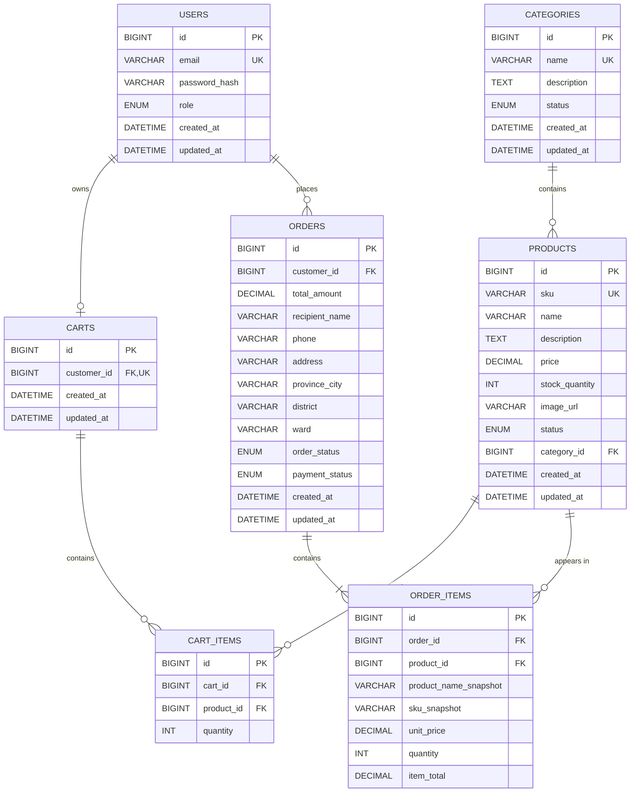

# Sơ đồ Quan hệ Thực thể (Entity Relationship Diagram)

## 1. Mục đích

Tài liệu này mô tả cấu trúc dữ liệu và mối quan hệ giữa các Entity của hệ thống Mini E-commerce dựa trên các yêu cầu đã được review và chốt trong thư mục `01-requirements`.

ERD được sử dụng để:

- Xác định các Entity chính của hệ thống.
- Xác định thuộc tính quan trọng của từng Entity.
- Xác định Primary Key và Foreign Key.
- Thể hiện các mối quan hệ giữa các Entity.
- Làm cơ sở cho thiết kế cơ sở dữ liệu MySQL.
- Đảm bảo thiết kế Database đồng bộ với Requirement và Class Diagram.
- Giữ mô hình dữ liệu đơn giản, phù hợp với phạm vi MVP.

---

# 2. Nguyên tắc thiết kế

## 2.1. Bám sát Requirement

ERD được xây dựng dựa trên:

- `requirement-clarification.md`
- `requirement-specification.md`
- `use-cases.md`

Không đưa thêm Entity hoặc chức năng ngoài phạm vi MVP.

## 2.2. Mô hình đơn giản

Hệ thống chỉ duy trì các Entity thực sự cần thiết:

- `users`
- `categories`
- `products`
- `carts`
- `cart_items`
- `orders`
- `order_items`

Các chức năng thanh toán không xây dựng thành Entity riêng. Hệ thống chỉ lưu `payment_status` trực tiếp trong `orders`.

## 2.3. Không sử dụng Guest Cart

Guest User chỉ được phép:

- Xem danh sách sản phẩm.
- Tìm kiếm sản phẩm.
- Xem chi tiết sản phẩm.

Cart chỉ được tạo cho Customer đã đăng nhập.

Do đó:

- Không có Guest Cart.
- Không có dữ liệu Guest Cart trong Database.
- Không có cơ chế Merge Cart khi đăng nhập.

## 2.4. Không tích hợp thanh toán trực tuyến trong MVP

MVP không triển khai:

- Payment Gateway.
- Bank Transfer.
- E-Wallet.
- Online Payment Provider.
- Transaction Reference.
- Payment Provider.

Hệ thống chỉ lưu trạng thái thanh toán của Order thông qua `payment_status`.

## 2.5. Không có Email Verification

User không có thuộc tính `email_verified` trong Database.

Email được sử dụng làm thông tin tài khoản/đăng nhập và phải là duy nhất.

---

# 3. Tổng quan các Entity

| Entity | Mục đích |
|---|---|
| `users` | Quản lý tài khoản Customer và Admin |
| `categories` | Quản lý danh mục sản phẩm |
| `products` | Quản lý thông tin và tồn kho sản phẩm |
| `carts` | Lưu giỏ hàng của Customer đã đăng nhập |
| `cart_items` | Lưu các sản phẩm trong Cart |
| `orders` | Lưu thông tin đơn hàng |
| `order_items` | Lưu các sản phẩm thuộc một đơn hàng |

---

# 4. Sơ đồ ERD



---

# 5. Đặc tả các Entity

## 5.1. `users`

Lưu thông tin tài khoản của Customer và Admin.

| Thuộc tính | Kiểu dữ liệu | Ràng buộc | Mô tả |
|---|---|---|---|
| `id` | `BIGINT` | PK | ID tài khoản |
| `email` | `VARCHAR` | UNIQUE, NOT NULL | Email đăng nhập |
| `password_hash` | `VARCHAR` | NOT NULL | Mật khẩu đã mã hóa |
| `role` | `ENUM` | NOT NULL | `CUSTOMER` hoặc `ADMIN` |
| `created_at` | `DATETIME` | NOT NULL | Thời gian tạo |
| `updated_at` | `DATETIME` | NOT NULL | Thời gian cập nhật |

### Role

```text
CUSTOMER
ADMIN
```

Admin không được tự đăng ký từ giao diện dành cho người dùng.

---

# 6. `categories`

Lưu thông tin danh mục sản phẩm.

| Thuộc tính | Kiểu dữ liệu | Ràng buộc | Mô tả |
|---|---|---|---|
| `id` | `BIGINT` | PK | ID danh mục |
| `name` | `VARCHAR` | UNIQUE, NOT NULL | Tên danh mục |
| `description` | `TEXT` | NULL | Mô tả |
| `status` | `ENUM` | NOT NULL | Trạng thái danh mục |
| `created_at` | `DATETIME` | NOT NULL | Thời gian tạo |
| `updated_at` | `DATETIME` | NOT NULL | Thời gian cập nhật |

### Category Status

```text
ACTIVE
INACTIVE
```

Danh mục `INACTIVE` không được sử dụng cho các thao tác kinh doanh mới nhưng vẫn được giữ lại trong Database.

---

# 7. `products`

Lưu thông tin sản phẩm.

| Thuộc tính | Kiểu dữ liệu | Ràng buộc | Mô tả |
|---|---|---|---|
| `id` | `BIGINT` | PK | ID sản phẩm |
| `sku` | `VARCHAR` | UNIQUE, NOT NULL | Mã sản phẩm |
| `name` | `VARCHAR` | NOT NULL | Tên sản phẩm |
| `description` | `TEXT` | NULL | Mô tả |
| `price` | `DECIMAL` | NOT NULL | Giá sản phẩm |
| `stock_quantity` | `INT` | NOT NULL | Số lượng tồn kho |
| `image_url` | `VARCHAR` | NULL | Đường dẫn hình ảnh |
| `status` | `ENUM` | NOT NULL | Trạng thái sản phẩm |
| `category_id` | `BIGINT` | FK, NOT NULL | Danh mục sản phẩm |
| `created_at` | `DATETIME` | NOT NULL | Thời gian tạo |
| `updated_at` | `DATETIME` | NOT NULL | Thời gian cập nhật |

### Product Status

```text
ACTIVE
INACTIVE
```

Sản phẩm `INACTIVE` không được hiển thị cho các thao tác mua hàng mới.

---

# 8. `carts`

Lưu giỏ hàng của Customer đã đăng nhập.

Mỗi Customer có tối đa một Cart.

| Thuộc tính | Kiểu dữ liệu | Ràng buộc | Mô tả |
|---|---|---|---|
| `id` | `BIGINT` | PK | ID Cart |
| `customer_id` | `BIGINT` | FK, UNIQUE, NOT NULL | Customer sở hữu Cart |
| `created_at` | `DATETIME` | NOT NULL | Thời gian tạo |
| `updated_at` | `DATETIME` | NOT NULL | Thời gian cập nhật |

`UNIQUE(customer_id)` đảm bảo một Customer không có nhiều Cart đang hoạt động.

---

# 9. `cart_items`

Lưu các sản phẩm trong Cart.

| Thuộc tính | Kiểu dữ liệu | Ràng buộc | Mô tả |
|---|---|---|---|
| `id` | `BIGINT` | PK | ID Cart Item |
| `cart_id` | `BIGINT` | FK, NOT NULL | Cart chứa sản phẩm |
| `product_id` | `BIGINT` | FK, NOT NULL | Sản phẩm |
| `quantity` | `INT` | NOT NULL | Số lượng |

Ràng buộc:

```text
UNIQUE(cart_id, product_id)
quantity > 0
```

Một Product chỉ xuất hiện một lần trong cùng một Cart.

---

# 10. `orders`

Lưu thông tin đơn hàng.

| Thuộc tính | Kiểu dữ liệu | Ràng buộc | Mô tả |
|---|---|---|---|
| `id` | `BIGINT` | PK | ID đơn hàng |
| `customer_id` | `BIGINT` | FK, NOT NULL | Customer tạo đơn |
| `total_amount` | `DECIMAL` | NOT NULL | Tổng giá trị đơn |
| `recipient_name` | `VARCHAR` | NOT NULL | Tên người nhận |
| `phone` | `VARCHAR` | NOT NULL | Số điện thoại |
| `address` | `VARCHAR` | NOT NULL | Địa chỉ |
| `province_city` | `VARCHAR` | NOT NULL | Tỉnh/thành phố |
| `district` | `VARCHAR` | NOT NULL | Quận/huyện |
| `ward` | `VARCHAR` | NOT NULL | Phường/xã |
| `order_status` | `ENUM` | NOT NULL | Trạng thái đơn hàng |
| `payment_status` | `ENUM` | NOT NULL | Trạng thái thanh toán |
| `created_at` | `DATETIME` | NOT NULL | Thời gian tạo |
| `updated_at` | `DATETIME` | NOT NULL | Thời gian cập nhật |

### Order Status

```text
PENDING
CONFIRMED
SHIPPING
DELIVERED
CANCELLED
```

### Payment Status

MVP chỉ lưu trạng thái thanh toán:

```text
UNPAID
PAID
```

Không có bảng `payments` riêng và không lưu thông tin payment provider.

---

# 11. `order_items`

Lưu các sản phẩm thuộc một đơn hàng.

| Thuộc tính | Kiểu dữ liệu | Ràng buộc | Mô tả |
|---|---|---|---|
| `id` | `BIGINT` | PK | ID Order Item |
| `order_id` | `BIGINT` | FK, NOT NULL | Đơn hàng |
| `product_id` | `BIGINT` | FK, NOT NULL | Product gốc |
| `product_name_snapshot` | `VARCHAR` | NOT NULL | Tên tại thời điểm đặt |
| `sku_snapshot` | `VARCHAR` | NOT NULL | SKU tại thời điểm đặt |
| `unit_price` | `DECIMAL` | NOT NULL | Giá tại thời điểm đặt |
| `quantity` | `INT` | NOT NULL | Số lượng |
| `item_total` | `DECIMAL` | NOT NULL | Thành tiền |

Công thức:

```text
item_total = unit_price × quantity
```

Thông tin snapshot giúp bảo toàn lịch sử đơn hàng ngay cả khi Product thay đổi sau đó.

---

# 12. Đặc tả các mối quan hệ

## 12.1. User - Cart

```text
users 1 ---- 0..1 carts
```

Một Customer có tối đa một Cart.

Không có Cart cho Guest.

---

## 12.2. User - Order

```text
users 1 ---- 0..* orders
```

Một Customer có thể tạo nhiều Order.

Mỗi Order thuộc về một Customer.

---

## 12.3. Category - Product

```text
categories 1 ---- 0..* products
```

Một Category có thể chứa nhiều Product.

Mỗi Product thuộc một Category.

---

## 12.4. Cart - CartItem

```text
carts 1 ---- 0..* cart_items
```

Một Cart có thể chứa nhiều CartItem.

---

## 12.5. CartItem - Product

```text
products 1 ---- 0..* cart_items
```

Một Product có thể xuất hiện trong nhiều Cart khác nhau.

---

## 12.6. Order - OrderItem

```text
orders 1 ---- 1..* order_items
```

Một Order phải có ít nhất một OrderItem.

Một OrderItem chỉ thuộc về một Order.

---

## 12.7. OrderItem - Product

```text
products 1 ---- 0..* order_items
```

OrderItem tham chiếu đến Product gốc nhưng đồng thời lưu snapshot của dữ liệu quan trọng.

---

# 13. Các ràng buộc dữ liệu quan trọng

## User

```text
email không được trùng
email không được NULL
password_hash không được NULL
role không được NULL
```

## Category

```text
name không được trùng
name không được NULL
```

## Product

```text
sku không được trùng
price >= 0
stock_quantity >= 0
```

## CartItem

```text
quantity > 0
UNIQUE(cart_id, product_id)
```

## OrderItem

```text
quantity > 0
unit_price >= 0
item_total = unit_price × quantity
```

## Order

```text
total_amount = tổng item_total
payment_status thuộc {UNPAID, PAID}
```

---

# 14. Chiến lược Index

Các index chính nên bao gồm:

```text
users(email)
categories(name)
products(sku)
products(category_id)
products(status)
carts(customer_id)
cart_items(cart_id, product_id)
orders(customer_id)
orders(order_status)
orders(payment_status)
orders(created_at)
order_items(order_id)
order_items(product_id)
```

Mục tiêu:

- Tìm tài khoản theo email nhanh hơn.
- Tìm sản phẩm theo SKU.
- Lọc sản phẩm theo danh mục/trạng thái.
- Truy vấn Cart của Customer.
- Truy vấn đơn hàng theo Customer.
- Lọc đơn hàng theo trạng thái.
- Truy vấn Order Item theo Order.

---

# 15. Tính toàn vẹn dữ liệu và Transaction

Checkout nên được xử lý trong một Database Transaction.

Quy trình:

```text
1. Kiểm tra Customer đã đăng nhập
2. Lấy Cart của Customer
3. Kiểm tra Cart có sản phẩm
4. Kiểm tra Product còn ACTIVE
5. Kiểm tra tồn kho
6. Tạo Order
7. Tạo OrderItem
8. Tính total_amount
9. Giảm stock_quantity
10. Đặt payment_status = UNPAID
11. Xóa các CartItem đã checkout
12. Commit Transaction
```

Nếu xảy ra lỗi trong quá trình trên:

```text
ROLLBACK
```

Điều này đảm bảo không xảy ra tình trạng:

- Đã tạo Order nhưng chưa tạo OrderItem.
- Đã giảm tồn kho nhưng Order không được tạo.
- Đã tạo Order nhưng Cart vẫn ở trạng thái không nhất quán.

---

# 16. Quy tắc quản lý tồn kho

Khi checkout:

```text
stock_quantity >= requested_quantity
```

Sau khi tạo Order thành công:

```text
new_stock_quantity
    = old_stock_quantity - ordered_quantity
```

Không cho phép:

```text
stock_quantity < 0
```

Product `INACTIVE` không được đặt hàng.

---

# 17. Quản lý trạng thái Product và Category

Không nhất thiết phải xóa vật lý dữ liệu Product hoặc Category khi không còn sử dụng.

Thay vào đó:

```text
ACTIVE
INACTIVE
```

được sử dụng để vô hiệu hóa dữ liệu.

Ví dụ:

```text
Product A
ACTIVE → INACTIVE
```

Product vẫn tồn tại trong Database để bảo toàn dữ liệu lịch sử.

---

# 18. Bảo toàn lịch sử đơn hàng

`OrderItem` lưu:

- `product_name_snapshot`
- `sku_snapshot`
- `unit_price`

Do đó, khi Product thay đổi:

```text
Product price: 100.000 → 120.000
```

Order cũ vẫn giữ:

```text
OrderItem.unit_price = 100.000
```

Điều này đảm bảo lịch sử đơn hàng không bị thay đổi theo dữ liệu Product hiện tại.

---

# 19. Các Entity chưa đưa vào MVP

Các Entity sau **không thuộc phạm vi MVP hiện tại**:

- `payments`
- `addresses`
- `coupons`
- `reviews`
- `wishlists`
- `product_images`
- `inventory_transactions`
- `refresh_tokens`
- `notifications`
- `payment_gateways`

Các Entity này chỉ được xem xét khi requirement trong tương lai thực sự yêu cầu.

---

# 20. Kết luận

ERD của Mini E-commerce được giữ ở mức tối giản và bám sát requirement đã chốt.

Mô hình cuối cùng gồm 7 Entity:

```text
users
categories
products
carts
cart_items
orders
order_items
```

Trong đó:

- User quản lý Customer và Admin.
- Cart chỉ dành cho Customer đã đăng nhập.
- Product thuộc Category.
- Cart chứa CartItem.
- Order chứa OrderItem.
- Order lưu trực tiếp `payment_status`.
- Không có bảng `payments`.
- Không có Guest Cart.
- Không có Merge Cart.
- Không có Email Verification.
- Không có Payment Gateway hoặc các phương thức thanh toán trực tuyến trong MVP.

Thiết kế này phù hợp với mục tiêu giữ Database đơn giản, dễ triển khai và dễ kiểm thử trong phạm vi dự án.
