# Sơ đồ Quan hệ Thực thể (Entity Relationship Diagram)

## 1. Mục đích

Tài liệu này mô tả thiết kế cơ sở dữ liệu cho hệ thống **Quản lý Bán hàng Mini (Mini E-commerce / Inventory Management)**.

ERD được xây dựng dựa trên các tài liệu yêu cầu và Use Case:

- `docs/01-requirements/requirement-clarification.md`
- `docs/01-requirements/requirement-specification.md`
- `docs/01-requirements/use-cases.md`

Cơ sở dữ liệu được thiết kế để sử dụng với **MySQL** và hỗ trợ các chức năng cốt lõi của phiên bản MVP:

- Xác thực người dùng và phân quyền.
- Quản lý sản phẩm và danh mục.
- Quản lý tồn kho.
- Giỏ hàng của khách vãng lai và khách hàng đã đăng nhập.
- Thanh toán và quản lý đơn hàng.
- Theo dõi trạng thái thanh toán.
- Xem lịch sử đơn hàng.
- Đảm bảo tính toàn vẹn dữ liệu sản phẩm và đơn hàng.

---

## 2. Nguyên tắc thiết kế

Thiết kế cơ sở dữ liệu tuân theo các nguyên tắc sau:

1. Sử dụng mô hình dữ liệu quan hệ, phù hợp với MySQL.
2. Lưu trữ tài khoản Customer và Admin trong cùng một bảng `users`, phân biệt bằng thuộc tính `role`.
3. Không lưu giỏ hàng của khách vãng lai trong cơ sở dữ liệu vì giỏ hàng này được lưu phía Client.
4. Lưu trữ thông tin tại thời điểm đặt hàng độc lập với thông tin sản phẩm hiện tại.
5. Bảo toàn dữ liệu lịch sử đơn hàng ngay cả khi sản phẩm được cập nhật hoặc ngừng kinh doanh.
6. Tách biệt trạng thái đơn hàng và trạng thái thanh toán.
7. Sử dụng Foreign Key và Unique Constraint để đảm bảo tính toàn vẹn dữ liệu.
8. Sử dụng cơ chế vô hiệu hóa (Soft Deactivation) thay vì xóa cứng đối với sản phẩm và danh mục khi cần thiết.
9. Giữ mô hình cơ sở dữ liệu đơn giản, tránh thêm các Entity chưa cần thiết trong phạm vi MVP.

---

## 3. Tổng quan các Entity

ERD bao gồm các Entity chính sau:

| Entity | Mục đích |
|---|---|
| `users` | Lưu trữ tài khoản Customer và Admin |
| `categories` | Lưu trữ danh mục sản phẩm |
| `products` | Lưu trữ thông tin sản phẩm và tồn kho hiện tại |
| `carts` | Lưu trữ giỏ hàng của khách hàng đã đăng nhập |
| `cart_items` | Lưu trữ sản phẩm và số lượng trong giỏ hàng |
| `orders` | Lưu trữ thông tin đơn hàng và địa chỉ giao hàng |
| `order_items` | Lưu trữ các sản phẩm trong đơn hàng và giá trị tại thời điểm mua |
| `payments` | Lưu trữ phương thức và trạng thái thanh toán của đơn hàng |

---

## 4. Sơ đồ Quan hệ Thực thể

Sơ đồ dưới đây mô tả các Entity, thuộc tính chính và mối quan hệ giữa chúng.

```mermaid
erDiagram

    USERS ||--o| CARTS : owns
    USERS ||--o{ ORDERS : places

    CATEGORIES ||--o{ PRODUCTS : contains

    CARTS ||--o{ CART_ITEMS : contains
    PRODUCTS ||--o{ CART_ITEMS : included_in

    ORDERS ||--|{ ORDER_ITEMS : contains
    PRODUCTS ||--o{ ORDER_ITEMS : ordered_as

    ORDERS ||--o| PAYMENTS : has

    USERS {
        BIGINT id PK
        VARCHAR email UK
        VARCHAR password_hash
        ENUM role
        BOOLEAN email_verified
        DATETIME created_at
        DATETIME updated_at
    }

    CATEGORIES {
        BIGINT id PK
        VARCHAR name UK
        TEXT description
        ENUM status
        DATETIME created_at
        DATETIME updated_at
    }

    PRODUCTS {
        BIGINT id PK
        VARCHAR sku UK
        VARCHAR name
        TEXT description
        DECIMAL price
        INT stock_quantity
        VARCHAR image_url
        BIGINT category_id FK
        ENUM status
        DATETIME created_at
        DATETIME updated_at
    }

    CARTS {
        BIGINT id PK
        BIGINT customer_id FK,UK
        DATETIME created_at
        DATETIME updated_at
    }

    CART_ITEMS {
        BIGINT id PK
        BIGINT cart_id FK
        BIGINT product_id FK
        INT quantity
        DATETIME created_at
        DATETIME updated_at
    }

    ORDERS {
        BIGINT id PK
        BIGINT customer_id FK
        DECIMAL total_amount
        VARCHAR recipient_name
        VARCHAR phone
        TEXT address
        VARCHAR province_city
        VARCHAR district
        VARCHAR ward
        ENUM order_status
        ENUM payment_status
        DATETIME created_at
        DATETIME updated_at
    }

    ORDER_ITEMS {
        BIGINT id PK
        BIGINT order_id FK
        BIGINT product_id FK
        VARCHAR product_name_snapshot
        VARCHAR sku_snapshot
        DECIMAL unit_price
        INT quantity
        DECIMAL item_total
    }

    PAYMENTS {
        BIGINT id PK
        BIGINT order_id FK,UK
        ENUM payment_method
        ENUM payment_status
        VARCHAR provider
        VARCHAR transaction_reference UK
        DATETIME paid_at
        DATETIME created_at
        DATETIME updated_at
    }
```



### Chú thích ký hiệu

| Ký hiệu | Ý nghĩa |
|---|---|
| PK | Primary Key - Khóa chính |
| FK | Foreign Key - Khóa ngoại |
| UK | Unique Key - Khóa duy nhất |
| `||` | Chính xác một |
| `o|` | Không hoặc một |
| `o{` | Không hoặc nhiều |
| `|{` | Một hoặc nhiều |

---

## 5. Đặc tả các Entity

### 5.1. Entity `users` - Người dùng

#### Mục đích

Lưu trữ thông tin xác thực và phân quyền cho cả Customer và Admin.

Hai loại tài khoản được lưu trong cùng một bảng và phân biệt thông qua thuộc tính `role`.

#### Các thuộc tính

| Trường | Kiểu dữ liệu | Khóa / Ràng buộc | Mô tả |
|---|---|---|---|
| `id` | BIGINT | PK | Mã định danh duy nhất của người dùng |
| `email` | VARCHAR(255) | UNIQUE, NOT NULL | Email đăng nhập |
| `password_hash` | VARCHAR(255) | NOT NULL | Mật khẩu đã được băm |
| `role` | ENUM | NOT NULL | `CUSTOMER` hoặc `ADMIN` |
| `email_verified` | BOOLEAN | NOT NULL | Trạng thái xác minh email |
| `created_at` | DATETIME | NOT NULL | Thời điểm tạo tài khoản |
| `updated_at` | DATETIME | NOT NULL | Thời điểm cập nhật gần nhất |

#### Quy tắc nghiệp vụ

- Email phải là duy nhất trong hệ thống.
- Mật khẩu không được lưu dưới dạng plaintext.
- Đăng ký công khai chỉ tạo tài khoản `CUSTOMER`.
- Tài khoản Admin được tạo thông qua cơ chế khởi tạo hoặc quản trị có kiểm soát, không đăng ký công khai.
- Backend thực hiện phân quyền dựa trên `role`.
- Customer không được truy cập các API chỉ dành cho Admin.
- JWT được sử dụng theo cơ chế stateless, không bắt buộc lưu JWT vào cơ sở dữ liệu.

---

### 5.2. Entity `categories` - Danh mục sản phẩm

#### Mục đích

Lưu trữ các danh mục sản phẩm trong hệ thống.

#### Các thuộc tính

| Trường | Kiểu dữ liệu | Khóa / Ràng buộc | Mô tả |
|---|---|---|---|
| `id` | BIGINT | PK | Mã danh mục |
| `name` | VARCHAR(100) | UNIQUE, NOT NULL | Tên danh mục |
| `description` | TEXT | NULL | Mô tả danh mục |
| `status` | ENUM | NOT NULL | `ACTIVE` hoặc `INACTIVE` |
| `created_at` | DATETIME | NOT NULL | Thời điểm tạo |
| `updated_at` | DATETIME | NOT NULL | Thời điểm cập nhật gần nhất |

#### Quy tắc nghiệp vụ

- Tên danh mục phải là duy nhất.
- Một danh mục có thể chứa nhiều sản phẩm.
- Mỗi sản phẩm thuộc chính xác một danh mục.
- Không được xóa cứng danh mục đang được sản phẩm tham chiếu.
- Có thể sử dụng cơ chế vô hiệu hóa danh mục thay cho xóa vật lý.

---

### 5.3. Entity `products` - Sản phẩm

#### Mục đích

Lưu trữ thông tin sản phẩm và số lượng tồn kho hiện tại.

#### Các thuộc tính

| Trường | Kiểu dữ liệu | Khóa / Ràng buộc | Mô tả |
|---|---|---|---|
| `id` | BIGINT | PK | Mã sản phẩm |
| `sku` | VARCHAR(100) | UNIQUE, NOT NULL | Mã SKU duy nhất |
| `name` | VARCHAR(255) | NOT NULL | Tên sản phẩm |
| `description` | TEXT | NULL | Mô tả sản phẩm |
| `price` | DECIMAL(12,2) | NOT NULL | Giá bán hiện tại |
| `stock_quantity` | INT | NOT NULL | Số lượng tồn kho hiện tại |
| `image_url` | VARCHAR(500) | NULL | URL hình ảnh chính |
| `category_id` | BIGINT | FK, NOT NULL | Danh mục sản phẩm |
| `status` | ENUM | NOT NULL | `ACTIVE` hoặc `INACTIVE` |
| `created_at` | DATETIME | NOT NULL | Thời điểm tạo |
| `updated_at` | DATETIME | NOT NULL | Thời điểm cập nhật gần nhất |

#### Quy tắc nghiệp vụ

- SKU phải là duy nhất.
- Giá sản phẩm phải lớn hơn `0`.
- Số lượng tồn kho phải lớn hơn hoặc bằng `0`.
- Sản phẩm phải thuộc chính xác một danh mục.
- Sản phẩm có `stock_quantity = 0` được xem là hết hàng.
- Customer không thể thêm sản phẩm không khả dụng vào giỏ hàng.
- Customer không thể mua số lượng vượt quá tồn kho hiện tại.
- Admin có thể cập nhật số lượng tồn kho.
- Không xóa cứng sản phẩm để bảo toàn các tham chiếu lịch sử đơn hàng.
- Sản phẩm có thể được kích hoạt hoặc vô hiệu hóa thông qua `status`.

---

### 5.4. Entity `carts` - Giỏ hàng

#### Mục đích

Lưu trữ giỏ hàng lâu dài của Customer đã đăng nhập.

| Trường | Kiểu dữ liệu | Khóa / Ràng buộc | Mô tả |
|---|---|---|---|
| `id` | BIGINT | PK | Mã giỏ hàng |
| `customer_id` | BIGINT | FK, UNIQUE, NOT NULL | Customer sở hữu giỏ hàng |
| `created_at` | DATETIME | NOT NULL | Thời điểm tạo giỏ hàng |
| `updated_at` | DATETIME | NOT NULL | Thời điểm cập nhật gần nhất |

#### Quy tắc nghiệp vụ

- Mỗi Customer có tối đa một giỏ hàng được lưu trong database.
- Mỗi giỏ hàng chỉ thuộc về một Customer.
- Giỏ hàng của khách vãng lai không được lưu trong bảng này.
- Giỏ hàng của khách vãng lai được lưu ở LocalStorage hoặc Session phía Frontend.
- Khi khách vãng lai đăng nhập, hệ thống có thể hợp nhất giỏ hàng tạm thời vào giỏ hàng của Customer.

---

### 5.5. Entity `cart_items` - Chi tiết giỏ hàng

#### Mục đích

Lưu trữ từng sản phẩm và số lượng của sản phẩm trong giỏ hàng.

| Trường | Kiểu dữ liệu | Khóa / Ràng buộc | Mô tả |
|---|---|---|---|
| `id` | BIGINT | PK | Mã chi tiết giỏ hàng |
| `cart_id` | BIGINT | FK, NOT NULL | Giỏ hàng tương ứng |
| `product_id` | BIGINT | FK, NOT NULL | Sản phẩm trong giỏ |
| `quantity` | INT | NOT NULL | Số lượng sản phẩm |
| `created_at` | DATETIME | NOT NULL | Thời điểm tạo |
| `updated_at` | DATETIME | NOT NULL | Thời điểm cập nhật gần nhất |

#### Ràng buộc

Áp dụng Unique Constraint kết hợp:

```sql
UNIQUE (cart_id, product_id)
```

Ràng buộc này đảm bảo cùng một sản phẩm chỉ xuất hiện tối đa một lần trong cùng một giỏ hàng.

#### Quy tắc nghiệp vụ

- Số lượng phải lớn hơn `0`.
- Số lượng không được vượt quá tồn kho hiện tại.
- Khi thêm sản phẩm đã tồn tại trong giỏ, hệ thống tăng số lượng thay vì tạo bản ghi mới.
- Sản phẩm không hoạt động hoặc hết hàng không thể được mua.
- Backend phải kiểm tra lại tồn kho tại thời điểm Checkout vì dữ liệu giỏ hàng có thể đã cũ.

---

### 5.6. Entity `orders` - Đơn hàng

#### Mục đích

Lưu trữ thông tin tổng quan của đơn hàng.

| Trường | Kiểu dữ liệu | Khóa / Ràng buộc | Mô tả |
|---|---|---|---|
| `id` | BIGINT | PK | Mã đơn hàng |
| `customer_id` | BIGINT | FK, NOT NULL | Customer đặt hàng |
| `total_amount` | DECIMAL(12,2) | NOT NULL | Tổng giá trị đơn hàng |
| `recipient_name` | VARCHAR(255) | NOT NULL | Tên người nhận |
| `phone` | VARCHAR(20) | NOT NULL | Số điện thoại người nhận |
| `address` | TEXT | NOT NULL | Địa chỉ giao hàng chi tiết |
| `province_city` | VARCHAR(100) | NOT NULL | Tỉnh / Thành phố |
| `district` | VARCHAR(100) | NOT NULL | Quận / Huyện |
| `ward` | VARCHAR(100) | NOT NULL | Phường / Xã |
| `order_status` | ENUM | NOT NULL | Trạng thái đơn hàng |
| `payment_status` | ENUM | NOT NULL | Trạng thái thanh toán |
| `created_at` | DATETIME | NOT NULL | Thời điểm tạo đơn |
| `updated_at` | DATETIME | NOT NULL | Thời điểm cập nhật gần nhất |

#### Trạng thái đơn hàng

```text
PENDING
CONFIRMED
SHIPPING
DELIVERED
CANCELLED
```

#### Luồng chuyển trạng thái hợp lệ

```text
PENDING
   ├──> CONFIRMED
   └──> CANCELLED

CONFIRMED
   └──> SHIPPING

SHIPPING
   └──> DELIVERED
```

`DELIVERED` và `CANCELLED` là các trạng thái kết thúc trong phạm vi MVP.

#### Quy tắc nghiệp vụ

- Chỉ Customer đã đăng nhập mới có thể tạo đơn hàng.
- Đơn hàng phải chứa ít nhất một `OrderItem`.
- Thông tin giao hàng được lưu trực tiếp trên đơn hàng.
- MVP không hỗ trợ nhiều địa chỉ giao hàng được lưu sẵn cho mỗi Customer.
- Customer chỉ có thể hủy đơn hàng khi đơn đang ở trạng thái `PENDING`.
- Admin có thể cập nhật trạng thái đơn hàng theo luồng hợp lệ.
- Admin không được thay đổi sản phẩm, số lượng hoặc thông tin giao hàng sau khi đơn đã được tạo.
- Tồn kho phải được kiểm tra lại trong quá trình Checkout.
- Việc tạo đơn hàng và trừ tồn kho phải được thực hiện nguyên tử (Atomic).
- Khi đơn hàng được tạo thành công, tồn kho được giảm tương ứng.
- Khi đơn hàng đủ điều kiện bị hủy, số lượng tồn kho đã trừ được hoàn lại.

---

### 5.7. Entity `order_items` - Chi tiết đơn hàng

#### Mục đích

Lưu trữ các sản phẩm thuộc một đơn hàng.

| Trường | Kiểu dữ liệu | Khóa / Ràng buộc | Mô tả |
|---|---|---|---|
| `id` | BIGINT | PK | Mã chi tiết đơn hàng |
| `order_id` | BIGINT | FK, NOT NULL | Đơn hàng tương ứng |
| `product_id` | BIGINT | FK, NOT NULL | Tham chiếu sản phẩm gốc |
| `product_name_snapshot` | VARCHAR(255) | NOT NULL | Tên sản phẩm tại thời điểm mua |
| `sku_snapshot` | VARCHAR(100) | NOT NULL | SKU tại thời điểm mua |
| `unit_price` | DECIMAL(12,2) | NOT NULL | Đơn giá tại thời điểm mua |
| `quantity` | INT | NOT NULL | Số lượng mua |
| `item_total` | DECIMAL(12,2) | NOT NULL | `unit_price × quantity` |

#### Quy tắc nghiệp vụ

- Một đơn hàng chứa một hoặc nhiều `OrderItem`.
- `unit_price` lưu giá sản phẩm tại thời điểm mua.
- `product_name_snapshot` và `sku_snapshot` bảo toàn thông tin sản phẩm tại thời điểm mua.
- Việc cập nhật Product sau khi đặt hàng không được làm thay đổi dữ liệu lịch sử đơn hàng.
- `product_id` vẫn giữ tham chiếu đến sản phẩm gốc.
- Việc vô hiệu hóa sản phẩm không được xóa các `OrderItem` lịch sử.

---

### 5.8. Entity `payments` - Thanh toán

#### Mục đích

Lưu trữ thông tin thanh toán liên quan đến đơn hàng.

| Trường | Kiểu dữ liệu | Khóa / Ràng buộc | Mô tả |
|---|---|---|---|
| `id` | BIGINT | PK | Mã bản ghi thanh toán |
| `order_id` | BIGINT | FK, UNIQUE, NOT NULL | Đơn hàng tương ứng |
| `payment_method` | ENUM | NOT NULL | Phương thức thanh toán |
| `payment_status` | ENUM | NOT NULL | Trạng thái thanh toán |
| `provider` | VARCHAR(50) | NULL | Nhà cung cấp dịch vụ thanh toán |
| `transaction_reference` | VARCHAR(100) | UNIQUE, NULL | Mã giao dịch bên ngoài |
| `paid_at` | DATETIME | NULL | Thời điểm thanh toán thành công |
| `created_at` | DATETIME | NOT NULL | Thời điểm tạo bản ghi |
| `updated_at` | DATETIME | NOT NULL | Thời điểm cập nhật gần nhất |

#### Phương thức thanh toán

MVP hỗ trợ:

```text
COD
BANK_TRANSFER
E_WALLET
ONLINE_PAYMENT
```

`COD` là phương thức thanh toán mặc định.

#### Trạng thái thanh toán

```text
UNPAID
PENDING
PAID
FAILED
```

Ví dụ:

| Trường hợp | Trạng thái ban đầu |
|---|---|
| Đơn COD | `UNPAID` |
| Bắt đầu thanh toán trực tuyến | `PENDING` |
| Thanh toán thành công | `PAID` |
| Thanh toán thất bại | `FAILED` |

#### Quy tắc nghiệp vụ

- Trạng thái thanh toán được quản lý độc lập với trạng thái đơn hàng.
- Đơn hàng có thể tồn tại trước khi thanh toán hoàn tất.
- COD không yêu cầu giao dịch qua cổng thanh toán trực tuyến.
- Phương thức thanh toán trực tuyến có thể lưu nhà cung cấp và mã giao dịch bên ngoài.
- `transaction_reference` phải là duy nhất khi có giá trị.
- Thông tin thanh toán không tự động quyết định trạng thái đơn hàng; hai loại trạng thái có vòng đời riêng biệt.

---

## 6. Đặc tả các mối quan hệ

| Mối quan hệ | Cardinality | Mô tả |
|---|---|---|
| Users - Carts | 1 : 0..1 | Một Customer có tối đa một giỏ hàng |
| Users - Orders | 1 : N | Một Customer có thể đặt nhiều đơn hàng |
| Categories - Products | 1 : N | Một danh mục chứa nhiều sản phẩm |
| Carts - CartItems | 1 : N | Một giỏ hàng chứa không hoặc nhiều CartItem |
| Products - CartItems | 1 : N | Một sản phẩm có thể xuất hiện trong nhiều giỏ hàng |
| Orders - OrderItems | 1 : N | Một đơn hàng chứa một hoặc nhiều OrderItem |
| Products - OrderItems | 1 : N | Một sản phẩm có thể xuất hiện trong nhiều đơn hàng lịch sử |
| Orders - Payments | 1 : 0..1 | Một đơn hàng có tối đa một bản ghi thanh toán trong MVP |

---

## 7. Các ràng buộc dữ liệu quan trọng

### 7.1. Ràng buộc bảng `users`

```text
users.email UNIQUE NOT NULL
users.role NOT NULL
users.password_hash NOT NULL
```

- Email không được trùng.
- Role chỉ nhận `CUSTOMER` hoặc `ADMIN`.

### 7.2. Ràng buộc bảng `categories`

```text
categories.name UNIQUE NOT NULL
categories.status NOT NULL
```

### 7.3. Ràng buộc bảng `products`

```text
products.sku UNIQUE NOT NULL
products.price > 0
products.stock_quantity >= 0
products.category_id NOT NULL
products.status NOT NULL
```

### 7.4. Ràng buộc bảng `carts`

```text
carts.customer_id UNIQUE NOT NULL
```

Đảm bảo mỗi Customer có tối đa một giỏ hàng.

### 7.5. Ràng buộc bảng `cart_items`

```text
cart_items.quantity > 0
UNIQUE (cart_id, product_id)
```

### 7.6. Ràng buộc bảng `orders`

```text
orders.customer_id NOT NULL
orders.total_amount >= 0
orders.order_status NOT NULL
orders.payment_status NOT NULL
```

### 7.7. Ràng buộc bảng `order_items`

```text
order_items.quantity > 0
order_items.unit_price > 0
order_items.item_total >= 0
order_items.order_id NOT NULL
order_items.product_id NOT NULL
```

### 7.8. Ràng buộc bảng `payments`

```text
payments.order_id UNIQUE NOT NULL
payments.payment_method NOT NULL
payments.payment_status NOT NULL
payments.transaction_reference UNIQUE
```

`transaction_reference` cho phép nhận giá trị `NULL` vì thanh toán COD không có mã giao dịch trực tuyến.

---

## 8. Chiến lược Index

Các Index sau nên được cân nhắc để cải thiện hiệu năng truy vấn.

| Bảng | Index | Mục đích |
|---|---|---|
| `users` | `UNIQUE(email)` | Đăng nhập và tìm kiếm email |
| `products` | `UNIQUE(sku)` | Tìm kiếm và kiểm tra SKU |
| `products` | `(category_id, status)` | Lọc sản phẩm theo danh mục và trạng thái |
| `products` | `(status)` | Lọc sản phẩm đang hoạt động |
| `products` | `(price)` | Sắp xếp hoặc lọc theo giá |
| `products` | `(name)` | Hỗ trợ tìm kiếm sản phẩm |
| `carts` | `UNIQUE(customer_id)` | Tìm giỏ hàng của Customer |
| `cart_items` | `(cart_id)` | Tải các sản phẩm trong giỏ |
| `cart_items` | `UNIQUE(cart_id, product_id)` | Ngăn sản phẩm trùng trong giỏ |
| `orders` | `(customer_id, created_at)` | Lịch sử đơn hàng của Customer |
| `orders` | `(order_status, created_at)` | Lọc đơn hàng trong trang Admin |
| `order_items` | `(order_id)` | Tải chi tiết đơn hàng |
| `order_items` | `(product_id)` | Tra cứu sản phẩm trong các đơn hàng |
| `payments` | `UNIQUE(order_id)` | Đảm bảo một bản ghi thanh toán cho mỗi đơn |

Các Index bổ sung có thể được thêm sau khi kiểm thử hiệu năng thực tế.

---

## 9. Tính toàn vẹn dữ liệu và Transaction

Các quy tắc sau được xử lý bởi tầng Transaction của Spring Boot kết hợp với các ràng buộc cơ sở dữ liệu.

### 9.1. Transaction trong Checkout

Quá trình Checkout nên được thực hiện trong một Transaction duy nhất:

```text
Xác thực Customer
      ↓
Tải giỏ hàng
      ↓
Kiểm tra trạng thái sản phẩm
      ↓
Kiểm tra tồn kho
      ↓
Tạo Order
      ↓
Tạo OrderItems
      ↓
Trừ tồn kho sản phẩm
      ↓
Tạo Payment
      ↓
Xóa các CartItem đã đặt hàng
      ↓
Commit Transaction
```

Nếu bất kỳ bước nào thất bại, toàn bộ Transaction phải được Rollback.

Điều này giúp tránh các tình huống:

- Đơn hàng được tạo nhưng tồn kho chưa bị trừ.
- Tồn kho bị trừ nhưng đơn hàng không được tạo.
- Đơn hàng được tạo với số lượng vượt quá tồn kho.
- Giỏ hàng bị xóa nhưng đơn hàng không được tạo thành công.

Cần áp dụng cơ chế kiểm soát đồng thời (Concurrency Control) khi nhiều Customer cùng mua một sản phẩm có số lượng tồn kho giới hạn.

---

## 10. Quy tắc quản lý tồn kho

Tồn kho được lưu trực tiếp tại:

```text
products.stock_quantity
```

MVP không tạo bảng `inventory` hoặc `stock_transactions` riêng.

### Quy tắc cơ bản

```text
stock_quantity >= 0
```

### Trong quá trình Checkout

```text
Tồn kho khả dụng >= Số lượng yêu cầu
```

### Sau khi Checkout thành công

```text
Tồn kho mới = Tồn kho cũ - Số lượng đặt mua
```

### Khi đơn hàng đủ điều kiện bị hủy

```text
Tồn kho khôi phục = Tồn kho hiện tại + Số lượng bị hủy
```

Các thao tác cập nhật tồn kho phải nằm trong Transaction để giảm nguy cơ bán vượt số lượng thực tế.

---

## 11. Cơ chế vô hiệu hóa dữ liệu (Soft Deactivation)

MVP sử dụng cơ chế vô hiệu hóa thông qua trường `status`.

### Product

```text
ACTIVE
INACTIVE
```

### Category

```text
ACTIVE
INACTIVE
```

Vô hiệu hóa không xóa bản ghi vật lý khỏi database.

Điều này giúp:

- Bảo toàn tham chiếu từ các `OrderItem` lịch sử.
- Tránh mất dữ liệu kinh doanh.
- Giữ lại thông tin phục vụ quản trị và kiểm tra lịch sử.

### Sản phẩm `INACTIVE`

- Không thể được thêm mới vào giỏ hàng.
- Không thể được mua.
- Có thể vẫn hiển thị trong giao diện quản trị.

### Danh mục `INACTIVE`

- Không được lựa chọn khi gán cho sản phẩm mới nếu nghiệp vụ không cho phép.
- Các sản phẩm hiện tại vẫn giữ liên kết với danh mục đó.

---

## 12. Thiết kế giỏ hàng khách vãng lai

Giỏ hàng của khách vãng lai không được lưu trong cơ sở dữ liệu quan hệ.

Luồng xử lý:

```text
Khách vãng lai
      ↓
LocalStorage / Session phía Frontend
      ↓
Thêm / Cập nhật / Xóa sản phẩm
      ↓
Đăng nhập
      ↓
Hợp nhất giỏ hàng tạm thời với giỏ hàng Customer
      ↓
Giỏ hàng Customer được lưu trong MySQL
```

Quá trình hợp nhất phải:

1. Đối chiếu sản phẩm bằng `product_id`.
2. Tăng số lượng nếu sản phẩm đã tồn tại trong giỏ hàng Customer.
3. Tạo `CartItem` mới nếu sản phẩm chưa tồn tại.
4. Kiểm tra lại trạng thái và tồn kho sản phẩm.
5. Đảm bảo số lượng cuối cùng không vượt quá tồn kho hiện tại.

---

## 13. Bảo toàn lịch sử đơn hàng

Thông tin lịch sử đơn hàng phải giữ nguyên sau khi đơn được tạo.

Vì vậy, bảng `order_items` lưu trữ:

```text
product_id
product_name_snapshot
sku_snapshot
unit_price
quantity
item_total
```

Trong khi đó, bảng `products` lưu trữ thông tin hiện tại:

```text
name
sku
price
stock_quantity
status
```

Điều này đảm bảo:

- Thay đổi giá sản phẩm không làm thay đổi giá trong đơn hàng cũ.
- Thay đổi tên sản phẩm không làm thay đổi tên trong đơn hàng cũ.
- Vô hiệu hóa sản phẩm không xóa sản phẩm khỏi lịch sử đơn hàng.

---

## 14. Ghi chú về chuẩn hóa dữ liệu

Cơ sở dữ liệu tuân theo các nguyên tắc chuẩn hóa dữ liệu quan hệ, đồng thời chủ động lưu trữ một số thông tin Snapshot trong `order_items`.

### Chuẩn hóa

- Mỗi trường chứa một giá trị nguyên tử.
- Thông tin sản phẩm được tách khỏi thông tin danh mục.
- Chi tiết đơn hàng được lưu thành các bản ghi riêng.
- Các mối quan hệ nhiều-nhiều được triển khai thông qua bảng trung gian.

### Denormalization có chủ đích

Các trường sau được sao chép có chủ đích trong `order_items`:

```text
product_name_snapshot
sku_snapshot
unit_price
item_total
```

Đây là quyết định thiết kế nhằm bảo toàn dữ liệu lịch sử giao dịch.

Ví dụ:

```text
products.price = Giá hiện tại của sản phẩm
order_items.unit_price = Giá tại thời điểm mua
```

Hai giá trị này không được xem là có thể thay thế cho nhau.

Tương tự:

```text
products.name = Tên hiện tại của sản phẩm
order_items.product_name_snapshot = Tên tại thời điểm mua
```

---

## 15. Các Entity chưa đưa vào MVP

Các Entity sau chưa được đưa vào thiết kế vì nằm ngoài phạm vi hiện tại hoặc chưa cần thiết cho MVP.

### `addresses`

Chưa cần thiết vì thông tin giao hàng được lưu trực tiếp trong Order và hệ thống chưa hỗ trợ nhiều địa chỉ giao hàng được lưu sẵn.

### `inventory`

Chưa cần thiết vì tồn kho được quản lý trực tiếp thông qua `products.stock_quantity`.

### `stock_transactions`

Chưa cần thiết vì MVP chưa yêu cầu lịch sử nhập, xuất hoặc điều chỉnh tồn kho.

### `coupons`

Chưa nằm trong phạm vi MVP vì chưa có chức năng mã giảm giá.

### `product_images`

Chưa cần thiết vì MVP chỉ yêu cầu một URL hình ảnh chính cho mỗi sản phẩm.

### `reviews`

Chưa nằm trong phạm vi yêu cầu hiện tại.

### `wishlists`

Chưa nằm trong phạm vi yêu cầu hiện tại.

### `refresh_tokens`

Chưa cần thiết vì hệ thống sử dụng cơ chế xác thực JWT stateless.

---

## 16. Tổng kết

Mô hình cơ sở dữ liệu MVP bao gồm tám Entity chính:

```text
users
categories
products
carts
cart_items
orders
order_items
payments
```

Luồng dữ liệu tổng quát:

```text
USER
 ├── CART
 │    └── CART_ITEM ─── PRODUCT ─── CATEGORY
 │
 └── ORDER
      ├── ORDER_ITEM ─── PRODUCT
      └── PAYMENT
```

Thiết kế này cung cấp nền tảng cho các chức năng:

- Xác thực Customer.
- Phân quyền Admin.
- Quản lý sản phẩm.
- Quản lý danh mục.
- Quản lý tồn kho.
- Xử lý giỏ hàng khách vãng lai và Customer.
- Checkout.
- Quản lý đơn hàng.
- Theo dõi thanh toán.
- Bảo toàn lịch sử giao dịch.

ERD là cơ sở để tiếp tục xây dựng:

- Class Diagram.
- API Specification.
- Thiết kế Database Schema.
- Triển khai Backend bằng Spring Boot.

**Trạng thái tài liệu:** Hoàn thành bản thiết kế ERD cho MVP, sẵn sàng review trước khi triển khai Database Schema và Class Diagram.

