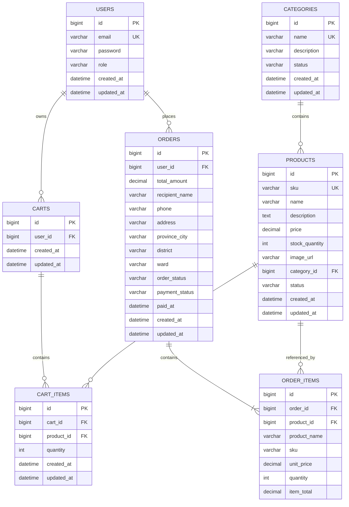

# Entity Relationship Diagram (ERD)

## 1. Information

| Item | Description |
|---|---|
| Project | Mini E-commerce / Inventory Management |
| Document | Entity Relationship Diagram |
| Status | Draft for Design |
| Database | MySQL |

* * *

# 2. Purpose

ERD mô tả cấu trúc dữ liệu quan hệ của hệ thống Mini E-commerce / Inventory Management.

ERD được xây dựng dựa trên Requirement Specification và tập trung vào các nghiệp vụ MVP:

* Authentication & Account
* Product Management
* Category Management
* Shopping Cart
* Checkout
* Order Management
* Inventory Management

Thiết kế ưu tiên:

* Dữ liệu đơn giản, phù hợp MVP.
* Tránh tạo Entity không cần thiết.
* Bảo toàn dữ liệu Order lịch sử.
* Đảm bảo các business rule quan trọng được thể hiện bằng Database Constraint và Relationship.

* * *

# 3. ERD Overview


```mermaid
erDiagram

    USERS ||--o{ CARTS : owns
    USERS ||--o{ ORDERS : places

    CATEGORIES ||--o{ PRODUCTS : contains

    CARTS ||--o{ CART_ITEMS : contains
    PRODUCTS ||--o{ CART_ITEMS : added_to

    ORDERS ||--|{ ORDER_ITEMS : contains
    PRODUCTS ||--o{ ORDER_ITEMS : referenced_by

    USERS {
        bigint id PK
        varchar email UK
        varchar password
        varchar role
        datetime created_at
        datetime updated_at
    }

    CATEGORIES {
        bigint id PK
        varchar name UK
        varchar description
        varchar status
        datetime created_at
        datetime updated_at
    }

    PRODUCTS {
        bigint id PK
        varchar sku UK
        varchar name
        text description
        decimal price
        int stock_quantity
        varchar image_url
        bigint category_id FK
        varchar status
        datetime created_at
        datetime updated_at
    }

    CARTS {
        bigint id PK
        bigint user_id FK
        datetime created_at
        datetime updated_at
    }

    CART_ITEMS {
        bigint id PK
        bigint cart_id FK
        bigint product_id FK
        int quantity
        datetime created_at
        datetime updated_at
    }

    ORDERS {
        bigint id PK
        bigint user_id FK
        decimal total_amount
        varchar recipient_name
        varchar phone
        varchar address
        varchar province_city
        varchar district
        varchar ward
        varchar order_status
        varchar payment_status
        datetime paid_at
        datetime created_at
        datetime updated_at
    }

    ORDER_ITEMS {
        bigint id PK
        bigint order_id FK
        bigint product_id FK
        varchar product_name
        varchar sku
        decimal unit_price
        int quantity
        decimal item_total
    }
```

> **Lưu ý:** Guest không phải là Database Entity. Guest là người dùng chưa authenticated và không có record riêng trong Database.

* * *

# 4. Entities

Hệ thống MVP gồm 7 Entity chính:

| # | Entity | Purpose |
|---:|---|---|
| 1 | `users` | Lưu tài khoản Customer và Admin |
| 2 | `categories` | Lưu danh mục sản phẩm |
| 3 | `products` | Lưu thông tin sản phẩm và tồn kho |
| 4 | `carts` | Lưu Cart của Customer |
| 5 | `cart_items` | Lưu Product và Quantity trong Cart |
| 6 | `orders` | Lưu thông tin đơn hàng |
| 7 | `order_items` | Lưu các Product thuộc Order và snapshot tại thời điểm mua |

Không có các Entity sau trong MVP:

* `payments`
* `payment_transactions`
* `addresses`
* `shipping_methods`
* `coupons`
* `discounts`
* `guest_carts`
* `email_verifications`

* * *

# 5. Entity Details

## 5.1. USERS

Lưu thông tin tài khoản của Customer và Admin.

### Attributes

| Field | Data Type | Constraint | Description |
|---|---|---|---|
| `id` | BIGINT | PK | User ID |
| `email` | VARCHAR | UNIQUE, NOT NULL | Email đăng nhập |
| `password` | VARCHAR | NOT NULL | Password đã hash |
| `role` | VARCHAR / ENUM | NOT NULL | `CUSTOMER` hoặc `ADMIN` |
| `created_at` | DATETIME | NOT NULL | Thời điểm tạo |
| `updated_at` | DATETIME | NOT NULL | Thời điểm cập nhật |

### Constraints

* `email` phải unique.
* `password` không được lưu plain text.
* `role` chỉ gồm:
  * `CUSTOMER`
  * `ADMIN`
* Public Registration chỉ tạo User có role `CUSTOMER`.
* Admin được tạo thông qua Database Seed/Migration.
* Không cần `account_status` trong MVP.

### Relationships

```text
USERS 1 ─────── N CARTS
USERS 1 ─────── N ORDERS
```

* * *

## 5.2. CATEGORIES

Lưu danh mục sản phẩm.

### Attributes

| Field | Data Type | Constraint | Description |
|---|---|---|---|
| `id` | BIGINT | PK | Category ID |
| `name` | VARCHAR | UNIQUE, NOT NULL | Category Name |
| `description` | VARCHAR / TEXT | NULL | Mô tả |
| `status` | VARCHAR / ENUM | NOT NULL | `ACTIVE` / `INACTIVE` |
| `created_at` | DATETIME | NOT NULL | Thời điểm tạo |
| `updated_at` | DATETIME | NOT NULL | Thời điểm cập nhật |

### Constraints

* Category Name phải unique.
* Category không có hierarchy.
* Category có thể `ACTIVE` hoặc `INACTIVE`.
* Category không được hard delete nếu vẫn còn Product tham chiếu.

### Relationships

```text
CATEGORY 1 ─────── N PRODUCTS
```

* * *

## 5.3. PRODUCTS

Lưu thông tin sản phẩm và tồn kho.

### Attributes

| Field | Data Type | Constraint | Description |
|---|---|---|---|
| `id` | BIGINT | PK | Product ID |
| `sku` | VARCHAR | UNIQUE, NOT NULL | Stock Keeping Unit |
| `name` | VARCHAR | NOT NULL | Product Name |
| `description` | TEXT | NULL | Product Description |
| `price` | DECIMAL | NOT NULL, > 0 | Giá sản phẩm |
| `stock_quantity` | INT | NOT NULL, >= 0 | Số lượng tồn kho |
| `image_url` | VARCHAR | NULL | URL ảnh chính |
| `category_id` | BIGINT | FK, NOT NULL | Category |
| `status` | VARCHAR / ENUM | NOT NULL | `ACTIVE` / `INACTIVE` |
| `created_at` | DATETIME | NOT NULL | Thời điểm tạo |
| `updated_at` | DATETIME | NOT NULL | Thời điểm cập nhật |

### Constraints

* `sku` phải unique.
* `price > 0`.
* `stock_quantity >= 0`.
* Product phải thuộc một Category.
* Product `INACTIVE` không được mua.
* Product có `stock_quantity = 0` được xem là Out of Stock.
* Delete Product là Soft Delete bằng cách chuyển `status = INACTIVE`.

### Relationships

```text
CATEGORIES 1 ─────── N PRODUCTS
```

* * *

## 5.4. CARTS

Lưu Cart của Customer đã đăng nhập.

### Attributes

| Field | Data Type | Constraint | Description |
|---|---|---|---|
| `id` | BIGINT | PK | Cart ID |
| `user_id` | BIGINT | FK, UNIQUE, NOT NULL | Customer sở hữu Cart |
| `created_at` | DATETIME | NOT NULL | Thời điểm tạo |
| `updated_at` | DATETIME | NOT NULL | Thời điểm cập nhật |

### Constraints

Mỗi Customer chỉ có tối đa một Active Cart.

Do MVP chỉ duy trì một Cart cho mỗi Customer, Database sử dụng:

```text
UNIQUE(user_id)
```

### Relationships

```text
USERS 1 ─────── 1 CARTS
```

* * *

## 5.5. CART_ITEMS

Lưu Product và Quantity trong Cart.

### Attributes

| Field | Data Type | Constraint | Description |
|---|---|---|---|
| `id` | BIGINT | PK | CartItem ID |
| `cart_id` | BIGINT | FK, NOT NULL | Cart |
| `product_id` | BIGINT | FK, NOT NULL | Product |
| `quantity` | INT | NOT NULL, > 0 | Số lượng |
| `created_at` | DATETIME | NOT NULL | Thời điểm tạo |
| `updated_at` | DATETIME | NOT NULL | Thời điểm cập nhật |

### Constraints

Database phải đảm bảo Product không xuất hiện nhiều lần trong cùng một Cart:

```text
UNIQUE(cart_id, product_id)
```

`quantity` phải lớn hơn `0`.

Stock được kiểm tra ở Application/Transaction level khi:

* Add to Cart.
* Update Cart Quantity.
* Checkout.

### Relationships

```text
CARTS 1 ─────── N CART_ITEMS
PRODUCTS 1 ─────── N CART_ITEMS
```

* * *

## 5.6. ORDERS

Lưu thông tin Order được tạo bởi Customer.

### Attributes

| Field | Data Type | Constraint | Description |
|---|---|---|---|
| `id` | BIGINT | PK | Order ID |
| `user_id` | BIGINT | FK, NOT NULL | Customer tạo Order |
| `total_amount` | DECIMAL | NOT NULL, >= 0 | Tổng tiền Order |
| `recipient_name` | VARCHAR | NOT NULL | Tên người nhận |
| `phone` | VARCHAR | NOT NULL | Số điện thoại người nhận |
| `address` | VARCHAR / TEXT | NOT NULL | Địa chỉ |
| `province_city` | VARCHAR | NOT NULL | Tỉnh/Thành phố |
| `district` | VARCHAR | NOT NULL | Quận/Huyện |
| `ward` | VARCHAR | NOT NULL | Phường/Xã |
| `order_status` | VARCHAR / ENUM | NOT NULL | Trạng thái Order |
| `payment_status` | VARCHAR / ENUM | NOT NULL | `UNPAID` / `PAID` |
| `paid_at` | DATETIME | NULL | Thời điểm thanh toán |
| `created_at` | DATETIME | NOT NULL | Thời điểm tạo |
| `updated_at` | DATETIME | NOT NULL | Thời điểm cập nhật |

### Order Status

```text
PENDING
CONFIRMED
SHIPPING
DELIVERED
CANCELLED
```

### Payment Status

```text
UNPAID
PAID
```

### Payment Rules

Order mới:

```text
order_status   = PENDING
payment_status = UNPAID
paid_at        = NULL
```

Khi Order chuyển sang:

```text
SHIPPING → DELIVERED
```

Backend tự động cập nhật:

```text
payment_status = PAID
paid_at        = current timestamp
```

Với các trạng thái khác `DELIVERED`:

```text
payment_status = UNPAID
paid_at        = NULL
```

### Important Design Decision

MVP không có bảng `payments`.

Payment Status chỉ là thuộc tính của Order.

Không lưu:

* Payment Method.
* Payment Gateway.
* Transaction ID.
* Payment Provider.
* Payment Transaction History.

### Shipping Information

Thông tin giao hàng được lưu trực tiếp trong Order thay vì tạo bảng `addresses`.

Lý do:

* MVP chỉ hỗ trợ một địa chỉ giao hàng cho mỗi Order.
* Thông tin giao hàng cần được snapshot tại thời điểm đặt hàng.
* Không cần quản lý Address Book của Customer.

### Relationships

```text
USERS 1 ─────── N ORDERS
ORDERS 1 ─────── N ORDER_ITEMS
```

* * *

## 5.7. ORDER_ITEMS

Lưu các Product thuộc Order và snapshot dữ liệu tại thời điểm mua.

### Attributes

| Field | Data Type | Constraint | Description |
|---|---|---|---|
| `id` | BIGINT | PK | OrderItem ID |
| `order_id` | BIGINT | FK, NOT NULL | Order |
| `product_id` | BIGINT | FK, NOT NULL | Product reference |
| `product_name` | VARCHAR | NOT NULL | Product Name snapshot |
| `sku` | VARCHAR | NOT NULL | SKU snapshot |
| `unit_price` | DECIMAL | NOT NULL, > 0 | Giá tại thời điểm mua |
| `quantity` | INT | NOT NULL, > 0 | Số lượng |
| `item_total` | DECIMAL | NOT NULL, >= 0 | Thành tiền |

### Snapshot Principle

`product_name`, `sku` và `unit_price` được snapshot tại thời điểm Checkout.

Ví dụ:

```text
Product:
    name  = "Keyboard"
    sku   = "KB-001"
    price = 500000

OrderItem:
    product_name = "Keyboard"
    sku          = "KB-001"
    unit_price   = 500000
```

Nếu Admin sau đó thay đổi Product:

```text
name
sku
price
```

thông tin lịch sử của OrderItem không được thay đổi.

### Relationships

```text
ORDERS 1 ─────── N ORDER_ITEMS
PRODUCTS 1 ─────── N ORDER_ITEMS
```

* * *

# 6. Relationship Summary

| Relationship | Cardinality | Description |
|---|---|---|
| User → Cart | 1 : 1 | Mỗi Customer có tối đa một Cart |
| User → Order | 1 : N | Một Customer có nhiều Order |
| Category → Product | 1 : N | Một Category có nhiều Product |
| Cart → CartItem | 1 : N | Một Cart có nhiều CartItem |
| Product → CartItem | 1 : N | Product có thể xuất hiện trong nhiều Cart |
| Order → OrderItem | 1 : N | Một Order có một hoặc nhiều OrderItem |
| Product → OrderItem | 1 : N | Product có thể xuất hiện trong nhiều Order lịch sử |

* * *

# 7. Foreign Key Summary

| Table | Foreign Key | References | Purpose |
|---|---|---|---|
| `products` | `category_id` | `categories.id` | Product thuộc Category |
| `carts` | `user_id` | `users.id` | Cart thuộc Customer |
| `cart_items` | `cart_id` | `carts.id` | CartItem thuộc Cart |
| `cart_items` | `product_id` | `products.id` | CartItem tham chiếu Product |
| `orders` | `user_id` | `users.id` | Order thuộc Customer |
| `order_items` | `order_id` | `orders.id` | OrderItem thuộc Order |
| `order_items` | `product_id` | `products.id` | OrderItem tham chiếu Product |

* * *

# 8. Important Database Constraints

## 8.1. Unique Constraints

```text
users.email
categories.name
products.sku
carts.user_id
(cart_items.cart_id, cart_items.product_id)
```

Trong đó:

```text
UNIQUE(cart_id, product_id)
```

đảm bảo một Product chỉ xuất hiện một lần trong cùng Cart.

* * *

## 8.2. Check Constraints

Nếu MySQL version/configuration hỗ trợ và áp dụng trong implementation:

```text
products.price > 0
products.stock_quantity >= 0

cart_items.quantity > 0

order_items.unit_price > 0
order_items.quantity > 0
order_items.item_total >= 0
```

Các validation nghiệp vụ quan trọng vẫn phải được kiểm tra ở Backend.

* * *

## 8.3. Status Constraints

### Product

```text
ACTIVE
INACTIVE
```

### Category

```text
ACTIVE
INACTIVE
```

### User Role

```text
CUSTOMER
ADMIN
```

### Order Status

```text
PENDING
CONFIRMED
SHIPPING
DELIVERED
CANCELLED
```

### Payment Status

```text
UNPAID
PAID
```

* * *

# 9. Delete and Referential Integrity Rules

## 9.1. Product

Product không được hard delete.

Khi Admin Delete Product:

```text
products.status = INACTIVE
```

Product vẫn tồn tại để:

* Bảo toàn Order history.
* Bảo toàn Product reference trong OrderItem.
* Có thể kiểm tra dữ liệu lịch sử.

* * *

## 9.2. Category

Category không được Delete nếu còn Product tham chiếu.

Ví dụ:

```text
Category A
    ↓
Product 1
Product 2
```

Nếu Admin Delete Category A:

```text
HTTP 409 Conflict
```

Không thay đổi dữ liệu.

Nếu muốn ẩn Category:

```text
categories.status = INACTIVE
```

* * *

## 9.3. Order

Order không được hard delete trong nghiệp vụ thông thường.

Order history phải được bảo toàn.

Customer/Admin chỉ thay đổi `order_status` theo các transition được phép.

* * *

# 10. Inventory Data Rules

Inventory được lưu trực tiếp trong:

```text
products.stock_quantity
```

Không tạo bảng Inventory riêng trong MVP.

### Checkout

Khi Checkout:

```text
stock_quantity = stock_quantity - order_quantity
```

Backend phải sử dụng cơ chế conditional update để tránh overselling:

```sql
UPDATE products
SET stock_quantity = stock_quantity - :quantity
WHERE id = :productId
  AND stock_quantity >= :quantity;
```

Backend kiểm tra số dòng affected.

Nếu:

```text
affected_rows = 0
```

thì không đủ Stock và Checkout phải thất bại.

### Cancel Order

Khi:

```text
PENDING → CANCELLED
```

Stock được hoàn lại:

```text
stock_quantity = stock_quantity + order_quantity
```

Việc cập nhật Order Status và restore Stock phải nằm trong cùng Transaction.

Không được restore Stock lần thứ hai.

* * *

# 11. Data Snapshot Strategy

Một số dữ liệu phải được snapshot để bảo toàn lịch sử Order.

## 11.1. Product Snapshot

OrderItem lưu:

```text
product_name
sku
unit_price
```

Không sử dụng Product hiện tại để thay thế dữ liệu lịch sử.

## 11.2. Shipping Snapshot

Order lưu:

```text
recipient_name
phone
address
province_city
district
ward
```

Không tạo Address entity riêng.

Điều này đảm bảo Order vẫn giữ đúng thông tin giao hàng tại thời điểm Checkout, ngay cả khi Customer thay đổi thông tin cá nhân sau đó.

* * *

# 12. Why These Entities Are Not Included

## 12.1. Payment

Không tạo `payments` vì MVP chỉ cần:

```text
Order.payment_status
Order.paid_at
```

Thanh toán trực tuyến và Payment Gateway nằm ngoài scope.

* * *

## 12.2. Address

Không tạo `addresses` vì MVP không hỗ trợ:

* Address Book.
* Multiple Addresses.
* Default Address Management.

Shipping Information được snapshot trực tiếp vào Order.

* * *

## 12.3. Inventory

Không tạo `inventory` entity riêng.

Stock được quản lý trực tiếp:

```text
Product.stock_quantity
```

Điều này phù hợp với quy mô Mini E-commerce và tránh over-engineering.

* * *

## 12.4. Guest Cart

Không tạo Guest Cart.

Guest chỉ có thể:

* Browse Product.
* Search.
* Filter.
* Sort.
* View Product Detail.

Muốn Add to Cart, Guest phải đăng nhập.

* * *

## 12.5. Coupon / Discount

Không tạo:

```text
coupons
discounts
promotions
```

vì Coupon/Promotion không thuộc MVP.

* * *

## 12.6. Email Verification

Không tạo:

```text
email_verifications
verification_tokens
```

vì Email Verification không thuộc MVP.

* * *

# 13. Transaction Boundaries

ERD phải hỗ trợ các transaction nghiệp vụ chính.

## 13.1. Checkout Transaction

```text
BEGIN TRANSACTION

1. Validate Customer
2. Validate Cart
3. Validate Product Status
4. Validate Stock
5. Create Order
6. Create OrderItems
7. Deduct Product Stock
8. Clear Cart

COMMIT
```

Nếu bất kỳ bước nào thất bại:

```text
ROLLBACK
```

* * *

## 13.2. Cancel Order Transaction

```text
BEGIN TRANSACTION

1. Check Order Status = PENDING
2. Update Order Status = CANCELLED
3. Restore Product Stock

COMMIT
```

Nếu một bước thất bại:

```text
ROLLBACK
```

* * *

# 14. Indexing Recommendations

Ngoài Primary Key và Unique Index, các trường thường xuyên được sử dụng để tìm kiếm/lọc nên được xem xét index.

## Recommended Indexes

| Table | Column(s) | Reason |
|---|---|---|
| `users` | `email` | Login / lookup |
| `products` | `sku` | SKU lookup |
| `products` | `category_id` | Category filter |
| `products` | `status` | Active/Inactive filter |
| `products` | `created_at` | Newest sorting |
| `products` | `price` | Price sorting/filter |
| `cart_items` | `cart_id` | Load Cart |
| `cart_items` | `product_id` | Product lookup |
| `orders` | `user_id` | Customer Order History |
| `orders` | `order_status` | Admin/Customer status filter |
| `orders` | `created_at` | Order sorting |
| `order_items` | `order_id` | Load Order Detail |
| `order_items` | `product_id` | Product reference |

Keyword search trên Product và Admin Order có thể cần database-specific optimization nếu dữ liệu tăng đáng kể. MVP chưa yêu cầu Search Engine riêng.

* * *

# 15. Referential Integrity Summary

```text
USERS
 ├── 1 : 1 ── CARTS
 │              │
 │              └── 1 : N ── CART_ITEMS ── N : 1 ── PRODUCTS
 │
 └── 1 : N ── ORDERS
                 │
                 └── 1 : N ── ORDER_ITEMS ── N : 1 ── PRODUCTS

CATEGORIES
 └── 1 : N ── PRODUCTS
```

* * *

# 16. ERD Design Decisions

| Decision | Rationale |
|---|---|
| Guest không phải Entity | Guest không có dữ liệu persistent |
| User chứa Customer và Admin | Chỉ có hai role trong Database |
| Một User tối đa một Cart | Phù hợp MVP |
| Không có Guest Cart | Guest phải login trước khi mua |
| Product chứa stock_quantity | Tránh Inventory Entity không cần thiết |
| Product Soft Delete | Bảo toàn dữ liệu lịch sử |
| Category không hard delete khi còn Product | Đảm bảo Referential Integrity |
| Order chứa Shipping Information | Snapshot dữ liệu giao hàng |
| OrderItem chứa Product snapshot | Bảo toàn lịch sử giá/tên/SKU |
| Không có Payment Entity | MVP chỉ quản lý payment status |
| `paid_at` nullable | Chỉ có giá trị khi Order DELIVERED |
| Không có Coupon/Discount Entity | Ngoài scope MVP |
| Không có Email Verification Entity | Ngoài scope MVP |

* * *

# 17. Consistency Rules with Requirements

ERD phải đáp ứng các requirement chính sau:

| Requirement | ERD Support |
|---|---|
| Customer Account | `users` |
| Admin Account | `users.role` |
| Product Management | `products` |
| Category Management | `categories` |
| Product-Category | `products.category_id` |
| Customer Cart | `carts` |
| Cart Items | `cart_items` |
| Checkout | `orders`, `order_items`, `products.stock_quantity` |
| Order History | `orders`, `order_items` |
| Inventory | `products.stock_quantity` |
| Product Snapshot | `order_items.product_name`, `sku`, `unit_price` |
| Shipping Snapshot | Order shipping fields |
| Payment Status | `orders.payment_status` |
| Payment Timestamp | `orders.paid_at` |
| Order Status | `orders.order_status` |
| Customer Ownership | `orders.user_id` |
| Admin Order Search | Order shipping fields + User email |
| Soft Delete Product | `products.status` |
| Category Soft Hide | `categories.status` |

* * *

# 18. Out of Scope

ERD không bao gồm các Entity cho:

* Payment Gateway.
* Payment Transaction.
* Coupon.
* Promotion.
* Discount.
* Guest Cart.
* Address Book.
* Shipping Method.
* Email Verification.
* Password Reset.
* Product Image Gallery.
* Category Hierarchy.
* Audit Log.
* Analytics.

Các Entity này chỉ được bổ sung nếu phạm vi nghiệp vụ của hệ thống được mở rộng trong tương lai.

* * *

# 19. Conclusion

ERD của Mini E-commerce MVP gồm 7 Entity chính:

```text
users
categories
products
carts
cart_items
orders
order_items
```

Thiết kế tập trung vào các nghiệp vụ cốt lõi:

```text
Customer
   ↓
Cart
   ↓
Checkout
   ↓
Order
   ↓
OrderItem
   ↓
Product
   ↓
Stock
```

Trong đó:

* `Product` quản lý thông tin sản phẩm và tồn kho.
* `Category` quản lý phân loại sản phẩm.
* `Cart` và `CartItem` quản lý giỏ hàng của Customer.
* `Order` quản lý thông tin đơn hàng, shipping snapshot, order status và payment status.
* `OrderItem` lưu snapshot của Product tại thời điểm mua.
* `User` xác định Customer/Admin và ownership của Cart/Order.

Thiết kế không tạo các Entity không cần thiết cho MVP, đặc biệt là `Payment`, `Inventory`, `Address` và `Guest Cart`.

ERD này là cơ sở cho:

```text
ERD
 ↓
Class Diagram
 ↓
API Specification
 ↓
Implementation
 ↓
Testing
```
